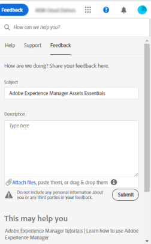

# Kom igång med [!DNL Experience Manager Assets Essentials] {#assets-essentials-get-started}

<!-- TBD: Make links for these steps. -->

Hantera era digitala resurser med [!DNL Assets Essentials] kräver endast tre enkla steg:

* **Steg 1**: [Överför](/help/add-delete.md) och [visa](/help/navigate-view.md) resurser.
* **Steg 2**: [Sök](/help/search.md) och [ladda ned](/help/manage-organize.md#download) resurser.
* **Steg 3**: [Hantera och ordna](/help/manage-organize.md) tillgångarna.

Används [!DNL Assets Essentials], logga in på [https://experience.adobe.com/#/assets](https://experience.adobe.com/#/assets). När du loggar in väljer du `Company or School Account`. Kontakta organisationens administratör för att få åtkomst.

Dessutom finns mer referensinformation som kan vara till hjälp [förstå användargränssnittet](/help/navigate-view.md), [lista över användningsfall](#use-cases), <!-- TBD: [supported file types](/help/supported-file-formats.md), --> och [kända problem](/help/release-notes.md#known-issues).

## Få åtkomst till [!DNL Assets Essentials] {#get-access}

Adobe tillhandahåller lösningen och lägger till den utsedda personen från din organisation som administratör. Administratörerna kan ge åtkomst till olika användare i organisationen genom att använda [[!DNL Admin Console]](https://helpx.adobe.com/enterprise/using/admin-console.html). Kontakta organisationens administratör för frågor som rör din åtkomst.

När du loggar in, efter att du angett inloggningsuppgifterna, [!DNL Assets Essentials] uppmanar dig att välja ett konto. I det här fallet väljer du `Company or School Account` för att fortsätta.

## Konfigurera [!DNL Assets Essentials] {#configuration}

Om du vill öppna inställningarna klickar du på avataren i det övre högra hörnet av användargränssnittet. Du kan växla mellan det ljusa och det mörka temat i lösningsinställningarna.

Om du är en del av olika organisationer kan du även ändra organisationen och få tillgång till dina konton i olika organisationer.

Ändra [!UICONTROL Experience Cloud preferences], klicka [!UICONTROL Preferences].

## [!DNL Assets Essentials] användningsfall {#use-cases}

De olika DAM-åtgärderna (Digital Asset Management) som du kan utföra med [!DNL Assets Essentials] nedan.

| Användaruppgifter | Funktionalitet och instruktionsinformation |
|-----|------|
| Bläddra bland och visa resurser | <ul> <li>[Bläddra i databasen](/help/navigate-view.md#view-assets-and-details) </li> <li> [Förhandsgranska en resurs](/help/navigate-view.md#preview-assets) <li> [Visa återgivningar av en resurs](/help/add-delete.md#renditions) </li> <li>[Visa versioner av en resurs](/help/manage-organize.md#view-versions)</li></ul> |
| Lägg till nya resurser | <ul> <li>[Överför nya resurser och mappar](/help/add-delete.md#add-assets)</li> <li>[Övervaka överföringsförloppet och hantera överföringar](/help/add-delete.md#upload-progress)</li> <li>[Lös dubbletter](/help/add-delete.md#resolve-upload-fails)</li> </ul> |
| Uppdatera resurser eller relaterad information | <ul> <li>[Redigera bilder](/help/edit-images.md)</li> <li>[Skapa versioner](/help/manage-organize.md#create-versions) och [visa versioner](/help/manage-organize.md#view-versions)</li> <li>[Redigera bilder](/help/edit-images.md)</li> </ul> |
| Redigera resurser | <ul> <li>[Redigeringar i webbläsaren med Adobe Photoshop Express](/help/edit-images.md)</li> <li>[Beskär för en profil för sociala medier](/help/edit-images.md#crop-straighten-images)</li> <li>[Visa och hantera versioner](/help/manage-organize.md#view-versions)</li> <li>[Använd [!DNL Adobe Asset Link]](/help/integration.md#integrations)</ul></ul> |
| Sök efter resurser i databasen | <ul> <li>[Sök i en viss mapp](/help/search.md#refine-search-results)</li> <li>[Sparade sökningar](/help/search.md#saved-search)</li> <li>[Sök efter nyligen visade resurser](/help/search.md)</li> <li>[Fulltextsökning](/help/search.md) |
| Hämta resurser | <ul> <li> [Förhandsgranska resurs](/help/navigate-view.md#preview-assets) </li> <li> [Hämta resurser](/help/manage-organize.md#download) <li> [Hämta återgivningar](/help/add-delete.md#renditions) </li></ul> |
| Metadataåtgärder | <ul> <li>[Visa detaljerade metadata](/help/metadata.md) </li> <li> [Uppdatera metadata](/help/metadata.md#update-metadata)</li> <li> [Skapa nytt metadataformulär](/help/metadata.md#metadata-forms) </li> </ul> |
| Integration med andra lösningar | <ul> <li>[Använd resursväljaren i [!DNL Adobe Journey Optimizer]](/help/integration.md)</li> <li>[[!DNL Adobe Asset Link] for [!DNL Creative Cloud]](/help/integration.md)</li> <li>[Integration med [!DNL Adobe Workfront]](/help/integration.md)</li> </ul> |

<!--TBD: Merge the below rows in the table when the use cases are documented/available.

| How do I delete assets? | <ul> <li>[Delete assets](/help/manage-organize.md)</li> <li>Recover deleted assets</li> <li>Permanently delete assets</li> </ul> |
| How do I share assets or find shared assets? | <ul> <li>Shared by me</li> <li>Shared with me</li> <li>Share for comments and review</li> <li>Unshare assets</li> </ul> |
| How do I collaborate with others and get my assets reviewed | <ul> <li>Share for review</li> <li>Provide comments. Resolve and filter comments</li> <li>Annotations on images</li> <li>Assign tasks to specific users and prioritize</li> </ul> |

-->

##  Ge feedback {#provide-feedback}

Adobe välkomnar feedback om lösningen. Använd [!UICONTROL Feedback] i användargränssnittet. Du kan även bifoga filer som skärmdumpar eller videoinspelningar av ett problem.

Klicka på [!UICONTROL Edit this page]  eller [!UICONTROL Log an issue]  från höger sidospalt. Du kan göra något av följande:

* Gör innehållsuppdateringarna och skicka en GitHub-pull-begäran.
* Skapa ett problem eller en biljett i GitHub. Behåll det automatiskt ifyllda artikelnamnet när du skapar ett problem.

>[!MORELIKETHIS]
>
>* [Förstå användargränssnittet](/help/navigate-view.md).
>* [Versionsinformation och kända fel](/help/release-notes.md).

<!-- TBD: 
>* [Supported file types](/help/supported-file-formats.md).
-->
