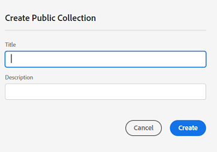
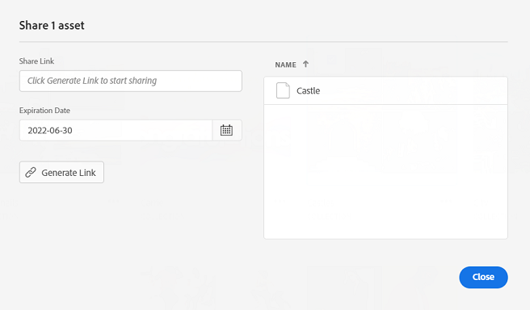

# Hantera samlingar {#manage-collections}

En samling är en uppsättning resurser i Experience Manager Assets Essentials. Använd samlingar för att dela resurser mellan användare.

Till skillnad från mappar kan en samling innehålla resurser från olika platser.

<!--
You can share collections with various users that are assigned different levels of privileges, including viewing, editing, and so on.
-->

Du kan dela flera samlingar med en användare. Varje samling innehåller referenser till resurser. Resursernas referensintegritet bevaras i alla samlingar.

Du kan utföra följande åtgärder för att hantera och använda samlingar:

* [Skapa en samling](#create-collection)

* [Lägga till resurser i en samling](#add-assets-to-collection)

* [Ta bort resurser från en samling](#remove-assets-from-collection)

* [Visa och redigera samlingsmetadata](#view-edit-collection-metadata)

* [Hämta samlingselement](#download-collection-elements)

* [Ta bort en samling](#delete-collection)

## Skapa en samling {#create-collection}

Så här skapar du en samling:

1. Klicka **[!UICONTROL Collections]** i den vänstra listen och klicka sedan **[!UICONTROL Create Collection]**.

1. Ange en rubrik och en valfri beskrivning för samlingen.

1. Klicka **[!UICONTROL Save]** för att skapa samlingen.

<!--

1. Select if you need to a create a Private collection or a Public collection.

   A Public collection is available for viewing and editing to all users. However, if you are a non-administrator user, a Private collection is available for viewing and editing only to users with the appropriate [permissions](#manage-collection-access). 

-->

## Lägga till resurser i en samling {#add-assets-to-collection}

Så här lägger du till resurser i en samling:

1. Klicka **[!UICONTROL Assets]** till vänster och välj tillgångar.

1. Klicka på **[!UICONTROL Add to Collection]**.

1. På [!UICONTROL Collections] väljer du de samlingar du vill lägga till de markerade resurserna i.

1. Klicka **[!UICONTROL Add]** om du vill lägga till resursen i de valda samlingarna.

Om du vill lägga till resurser i samlingen kan du även klicka på **[!UICONTROL Collections]** i det vänstra fältet klickar du på samlingen för att lägga till resurser i och klickar på **[!UICONTROL Add to Collection]**, markera resursen/resurserna och klicka på **[!UICONTROL Select]**.

## Ta bort resurser från en samling {#remove-assets-from-collection}

Så här tar du bort resurser från en samling:

1. Klicka **[!UICONTROL Collections]** i den vänstra listen för att visa en lista över samlingar.

1. Klicka på samlingen och välj de resurser som du vill ta bort från samlingen.

1. Klicka på **[!UICONTROL Remove]**.

<!--

## Manage access to a Private collection {#manage-collection-access}

The permission management for collections function in the same manner as folders in [!DNL Assets Essentials]. Administrators can manage the access levels for collections available in the repository. As an administrator, you can create user groups and assign permissions to those groups to manage access levels. You can also delegate the permission management privileges to user groups at the collection-level.

For more information, see [Manage permissions for folders and collections](manage-permissions.md).

-->

<!--

## Search a collection {#search-collections}

Click **[!UICONTROL Collections]** in the left rail and use the Search box to specify a text as the criteria to search for a collection. [!DNL Assets Essentials] uses the specified text to search collection names, metadata including tags defined for a collection and returns appropriate results.

>[!NOTE]
>
>Assets Essentials performs search in collections available at the root level. It does not perform search in assets and folders available in collections.

-->

## Visa och redigera samlingsmetadata {#view-edit-collection-metadata}

Samlingsmetadata omfattar data om samlingen, till exempel titel och beskrivning.

Så här visar och redigerar du samlingens metadata:

1. Klicka **[!UICONTROL Collections]** i den vänstra listen väljer du en samling och klickar på **[!UICONTROL Details]**.
1. Visa samlingens metadata med **[!UICONTROL Basic]** -fliken.
1. Ändra metadatafälten efter behov. Du kan ändra [!UICONTROL Title], [!UICONTROL Description]och [!UICONTROL Author] fält.

## Dela länkar för samlingar {#share-collection-links}

[!DNL Assets Essentials] gör att du kan skapa en länk och dela samlingar och resurser i samlingar med externa intressenter som inte har tillgång till [!DNL Assets Essentials] program. Du kan definiera ett förfallodatum för länken och sedan dela det med andra via den kommunikationsmetod du föredrar, som e-post eller meddelandetjänster. Mottagarna av länken kan förhandsgranska resurser och hämta dem.

Mer information om hur du delar samlingslänkar med externa intressenter finns i [Dela länkar för resurser](share-links-for-assets.md).

## Hämta en samling {#download-collection}

Så här hämtar du en samling:

1. Klicka **[!UICONTROL Collections]** till vänster.

1. Välj den samling du vill hämta och klicka på **[!UICONTROL Download]**.

1. På [!UICONTROL Downloading Asset] klickar du på **[!UICONTROL OK]**.

Samlingen laddas ned som en ZIP-fil på den lokala datorn.

## Ta bort en samling {#delete-collection}

Så här tar du bort en samling:

1. Klicka **[!UICONTROL Collections]** till vänster.

1. Markera den samling som du vill ta bort.

1. Klicka på **[!UICONTROL Delete]**.

## Nästa steg {#next-steps}

* Ge produktfeedback med [!UICONTROL Feedback] finns i Assets Essentials användargränssnitt

* Ge feedback på dokumentationen med [!UICONTROL Edit this page]  eller [!UICONTROL Log an issue]  som finns till höger

* Kontakt [Kundtjänst](https://experienceleague.adobe.com/?support-solution=General#support)
