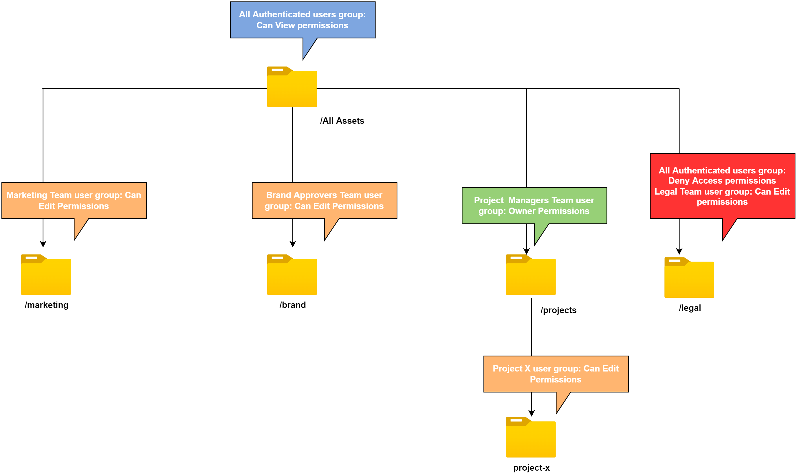

# Hantera behörigheter för mappar

I Assets Essentials kan administratörer hantera åtkomstnivåerna för de mappar som är tillgängliga i databasen. Som administratör kan du skapa användargrupper och tilldela behörigheter till dessa grupper för att hantera åtkomstnivåer. Du kan även delegera behörighetshanteringsprivilegier till användargrupper på mappnivå.

I följande dataflödesdiagram visas de åtgärder som du utför för att konfigurera och hantera behörigheter för mappar som är tillgängliga i Assets Essentials-databasen:

## Innan du hanterar behörigheter för mappar {#before-managing-permissions}

Innan du börjar hantera behörigheter för mappar i din Assets Essentials-databas måste du utföra vissa uppgifter, som att lägga till administratörer som kan skapa en logisk mappstruktur, skapa användargrupper och hantera mappbehörigheter för olika användargrupper.

### Lägg till administratörer {#add-admin-users}

Lägg till administratörer för Assets Essentials-programmet så att de kan hantera mappbehörigheter för andra användargrupper.

Så här lägger du till administratörer:

1. Åtkomst [Admin Console](https://adminconsole.adobe.com) för din organisation klickar du på **[!UICONTROL Products]** i det övre fältet klickar du på **[!UICONTROL AEM Assets Essentials]** och klicka sedan på [!DNL Assets Essentials] miljö. [!DNL Assets Essentials] har tre produktprofiler som ger åtkomst för administratörer, vanliga användare och konsumentanvändare.

   

1. Om du vill lägga till en användare i en grupp klickar du på gruppen Assets Essentials-administratörer och väljer **[!UICONTROL Add User]**, anger användarinformationen och klickar på **[!UICONTROL Save]**.

   

   När du lägger till en användare får användaren en e-postinbjudan om att komma igång. Du kan inaktivera e-postinbjudningarna i inställningarna för produktprofilen i [!DNL Admin Console].

1. Om du vill ta bort en användare från en grupp klickar du på gruppen, markerar en befintlig användare och väljer **[!UICONTROL Remove User]**.

### Lägg till användargrupper {#add-user-groups}

Skapa användargrupper och tilldela behörigheter till dessa grupper för att hantera mappåtkomstnivåer i Assets Essentials-databasen. Du kan sedan tilldela dina användare till användargrupperna.

Du kan lägga till användare i användargrupper (1) och [användare till Assets Essentials produktprofiler (2)](#add-admin-users). Du kan dock inte lägga till användargrupper direkt i Assets Essentials produktprofiler (3).

Mer information om hur du hanterar användargrupper finns i `Create user groups` och `Edit user groups` finns på [Hantera användargrupper](https://helpx.adobe.com/enterprise/using/user-groups.html).

>[!NOTE]
>
>Om Admin Console är konfigurerat för att utnyttja ett externt system för att hantera användare/grupper-tilldelningar, till exempel Azure- eller Google-anslutningar, användarsynkroniseringsverktyg eller API för användarhanteringsmål, konfigureras dina grupper och användartilldelningar automatiskt. Mer information finns i [Adobe Admin Console](https://helpx.adobe.com/enterprise/using/users.html).

### Lägg till användare i grupper {#add-users-to-uesr-groups}

När du har skapat användargrupper kan du börja lägga till användare i användargrupper.

Mer information om hur du hanterar tillägg av användare i användargrupper finns i `Add users to groups` finns på [Hantera användargrupper](https://helpx.adobe.com/in/enterprise/using/user-groups.html#add-users-to-groups).

### Skapa mappstruktur {#create-folder-structure}

Du kan använda följande metoder för att skapa en mappstruktur i Assets Essentials-databasen:

* Klicka på **[!UICONTROL Create Folder]** som finns i verktygsfältet för att skapa en tom mapp.

* Klicka **[!UICONTROL Add Assets]** i verktygsfältet till [ladda upp en mappstruktur som är tillgänglig på din lokala dator](add-delete.md).

Skapa en mappstruktur som fungerar bra med organisationens affärsmål. Om du överför en befintlig mappstruktur till Assets Essentials-databasen bör du granska strukturen. Mer information finns i [Effektiv behörighetshantering](permission-management-best-practices.md).

## Hantera behörigheter för mappar {#manage-permissions-on-folders}

Du kan tilldela följande behörigheter till användargrupperna eller användarna. Adobe rekommenderar inte att du tilldelar behörigheter till användare.

| Behörighetsnamn | Beskrivning |
|-----|------|
| Kan visa | <ul><li>Läsbehörighet för att visa och navigera i mappar </li><li>Förhandsgranska resurser</li><li>Hämta resurser</li><li>Kopiera resurser</li><li>Dela länkar till resurser</li><ul> |
| Kan redigera | <ul><li>Alla privilegier som är tillgängliga för Kan visa behörigheter </li><li>Skapa mappar</li><li>Ta bort mappar</li><li>Byt namn på mappar</li><li>Skapa resurser</li><li>Uppdatera resurser</li><li>Ta bort resurser</li><li>Flytta resurser</li><li>Byt namn på resurser</li><ul> |
| Ägare | <ul><li>Alla behörigheter som är tillgängliga för behörigheten Kan redigera</li><li>Hantera behörigheter för en mapp och dess undermappar</li>Med den här behörigheten kan administratörer delegera administratörsbehörighet till andra för en mapp och dess undermappar.<ul> |
| Neka åtkomst | Behörigheterna Ta bort Kan visa, Kan redigera och Ägare för en mapp och dess undermappar. |

**Standardbehörigheter**

Alla användare som är autentiserade och kan logga in i Assets Essentials har `Can Edit` behörighet till Assets Essentials-databasen från början. Administratören kan ändra standardbehörigheterna med [redigera behörigheter för hela Assets Essentials-databasen](#edit-permissions-entire-repository).

**Sekvens att tilldela mappbehörigheter till användargrupper**

Skapa regler för att tilldela mappbehörigheter till användargrupper. Den sekvens som du använder för att tilldela behörigheter till en mapp är viktig och avgör vilken åtkomst som är tillgänglig för användargrupperna och så småningom användarna.

Om du till exempel tilldelar `Can View` behörigheter för en mapp till en överordnad grupp och tilldela sedan `Can Edit` behörighet till undergruppen, endast medlemmarna i undergruppen har redigeringsbehörighet för mappen. Supergruppsanvändarna har visningsåtkomst till mappen.

Om du behöver ange redigeringsbehörigheter för `Marketing` mapp endast till din organisations marknadsföringsavdelning och visa behörigheter för andra, tilldela `Can View` behörigheter till supergrupp `All Authenticated Users` och `Can Edit` behörigheter till undergruppen `Marketing`.

**Tillståndsarv**

I Assets Essentials används behörighetsarv, vilket gör att du kan ärva behörighetsuppsättningen för den överordnade mappen i den underordnade mappen. Om den överordnade mappen till exempel har `Can View` behörigheter för `All Authenticated Users` gruppen och den underordnade mappen har `Can Edit` behörigheter för `Marketing` användargrupp, aktiverar det för alla autentiserade användare att ha visningsbehörighet för den underordnade mappen och `Marketing` användargrupp som ska ha redigeringsbehörighet för den underordnade mappen. The `Marketing` användargruppen har redigeringsbehörighet för ytterligare mappnivåer under den underordnade mappen (Marketing).

>[!NOTE]
>
> Ställa in en `Deny Access` behörigheter för en grupp på en mapp på högre nivå och sedan återställa åtkomsten (`Can view`, `Can edit` eller `Owner`) för den gruppen eller dess medlem stöds inte. Använd `Deny Access` sparsamt.

### Lägga till behörigheter i användargrupper {#add-permissions}

Så här tilldelar du gruppbehörigheter till mappar:

1. Markera mappen och klicka på **[!UICONTROL Manage Permissions]**.

1. På **[!UICONTROL Manage Permissions]** anger du namnet på gruppen eller en användare i dialogrutan **[!UICONTROL Groups & Users]** fält.

1. Välj [åtkomstnivå](#manage-permissions-folders) från **[!UICONTROL Access]** listruta.

1. Klicka **[!UICONTROL Add]** för att omedelbart ändra behörigheterna för användaren eller användargruppen.

1. Upprepa steg 1-3 för att lägga till fler regler i **[!UICONTROL Manage Permissions]** -dialogrutan.

   

   >[!NOTE]
   >
   > Den ordning som du använder för att tilldela behörigheter till en mapp är viktig och avgör vilken åtkomst som är tillgänglig för användargrupperna och så småningom vilka användare som läggs till i grupperna.

   Om du hanterar behörigheter för flera mappar kan du även välja en annan mapp i den vänstra rutan och börja hantera behörigheter för den mappen.

1. Klicka på **[!UICONTROL Close]**.

>[!CAUTION]
>
> Vi rekommenderar att du hanterar behörigheter för användargrupper och inte för enskilda användare. Ange `Deny access` behörighet stöds bara för användargrupper, men inte för enskilda användare.

### Redigera behörigheter som tilldelats användargrupper {#edit-permissions}

Så här redigerar du behörigheter som tilldelats användargrupper i mappar:

1. Markera mappen och klicka på **[!UICONTROL Manage Permissions]**.

1. På **[!UICONTROL Manage Permissions]** dialogruta, redigera [åtkomstnivå](#manage-permissions-folders) från **[!UICONTROL Access]** listruta.

1. [Lägga till fler användargrupper eller användare](#add-permissions) befintliga behörighetsregler, om det behövs.

1. Klicka på X om du vill ta bort de behörigheter som tilldelats en användargrupp.

### Redigera behörigheter för hela Assets Essentials-databasen {#edit-permissions-entire-repository}

En programadministratör kan redigera behörigheter för hela Assets Essentials-databasen från en standarddatabas `Can Edit` till någon annan åtkomstnivå.

Så här redigerar du behörigheter för hela Assets Essentials-databasen:

1. Markera en mapp och klicka på **[!UICONTROL Manage Permissions]**.

1. På **[!UICONTROL Manage Permissions]** dialogruta, klicka **[!UICONTROL All Assets]** till vänster.

1. [Redigera behörigheter](#edit-permissions) och stäng dialogrutan.

>[!NOTE]
>
>En administratör kan inte välja `Deny Access` behörighetsnivån för hela Assets Essentials-databasen för att säkerställa att användarna åtminstone har läsbehörighet till programmet. På samma sätt `All Authenticated Users` har minst läsbehörighet till databasen, även om administratören uttryckligen tar bort `Can Edit` behörigheter för [!UICONTROL Manage Permissions] -dialogrutan.

## Exempel på effektiv behörighetshantering {#example-permission-management}

**Användningsfall**

* Alla gruppen Autentiserade användare har visningsåtkomst till databasen.
* Teamspecifika användargrupper har redigeringsbehörigheter i sin egen funktionsspecifika mapp.
* Juridisk mapp är inte tillgänglig för visning av någon autentiserad användare förutom det juridiska teamet.

Skapa följande användargrupper i Admin Console:

* Marknadsföringsteam

* Grupp för varumärkesgodkännare

* Projektledare

* Project X-teamet

* Jurister

I följande diagram visas mapphierarkin och de behörigheter som tilldelats respektive användargrupp:

Följande åtkomstnivåer gäller för alla användargrupper i mapphierarkin:

* /Alla resurser: Administratören ändrar behörigheterna på rotnivån från standardvärdet `Can Edit` till `Can View`. Alla användare kan visa mappar och resurser, men de kan inte redigera dem.

* /marketing: Alla användare kan visa mapparna och undermapparna baserat på behörighetsarv, men gruppen som använder Marketing Team har redigeringsbehörigheter för mappen.

* /brand: Alla användare kan visa mapparna och undermapparna baserat på behörighetsarv, men användargruppen för godkännande av varumärken har redigeringsbehörigheter för mappen.

* /projects: Alla användare kan visa mapparna och undermapparna baserat på behörighetsarv. Användargruppen Projektledare har:

   * Redigera behörigheter

   * Ägarbehörigheter: Hantera behörigheter för en mapp och dess undermappar.

* /projects/project-x: Alla användare kan visa mapparna och dess undermappar. Användargruppen Projektledare i teamet har redigeringsbehörigheter och kan hantera behörigheter för en mapp och dess undermappar (ägarbehörigheter). Användargruppen Project X Team har redigeringsbehörighet.

* /legal: Ingen användare har åtkomst till mappen baserat på `Deny Access` behörigheter för `All Authenticated Users` grupp. Användargruppen Legal Team har redigeringsbehörighet.

## Nästa steg {#next-steps}

* [Se en video om hur du hanterar behörigheter i Assets Essentials](https://experienceleague.adobe.com/docs/experience-manager-learn/assets-essentials/configuring/permissions-management.html)

* Ge produktfeedback med [!UICONTROL Feedback] finns i Assets Essentials användargränssnitt

* Ge feedback på dokumentationen med [!UICONTROL Edit this page]  eller [!UICONTROL Log an issue]  som finns till höger

* Kontakt [Kundtjänst](https://experienceleague.adobe.com/?support-solution=General#support)
