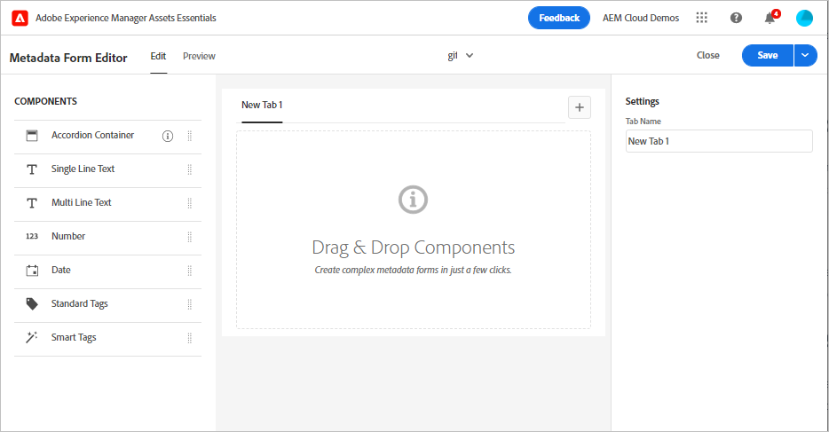

# Metadata i [!DNL Assets Essentials] {#metadata}

Metadata innebär data eller beskrivning av data. Dina bilder som en resurs kan t.ex. innehålla information om kameran som användaren klickade på eller copyright-information. Den här informationen är bildens metadata. Metadata är avgörande för effektiv resurshantering. Metadata är en samling av alla data som är tillgängliga för en tillgång, men de kanske inte nödvändigtvis finns i den tillgången.

Metadata hjälper er att kategorisera resurser ytterligare och är till hjälp när mängden digital information växer. Det går att hantera några hundra filer baserat på bara filnamn, miniatyrbilder och minne. Den här metoden är dock inte skalbar. Den blir kort när antalet inblandade personer och antalet hanterade resurser ökar.

Med hjälp av metadata ökar värdet på en digital resurs eftersom resursen blir

* Mer åtkomligt - system och användare hittar det enkelt.
* Enklare att hantera - du kan hitta resurser med samma uppsättning egenskaper enklare och använda ändringarna på dem.
* Fullständigt - materialet innehåller mer information och sammanhang med fler metadata.

Av dessa anledningar ger Assets dig rätt sätt att skapa, hantera och utbyta metadata för dina digitala resurser.

## Visa metadata {#view-metadata}

Om du vill visa metadata för en resurs bläddrar du till resursen eller söker efter resursen, markerar resursen och klickar på **[!UICONTROL Details]** i verktygsfältet.

*Bild: Om du vill visa en resurs och dess metadata klickar du **[!UICONTROL Details]**i verktygsfältet eller dubbelklickar på resursen.*

Grundläggande metadata som titel, beskrivning och överföringsdatum finns på fliken [!UICONTROL Basic]. Fliken [!UICONTROL Advanced] innehåller mer avancerade metadata som kameramodell, objektivdetaljer och geotaggar. Fliken [!UICONTROL Tags] innehåller automatiskt tillämpade taggar baserat på bildens innehåll.

## Uppdatera metadata {#update-metadata}

Du kan uppdatera några metadatafält manuellt. Fälten innehåller [!UICONTROL Title], [!UICONTROL Description], [!UICONTROL Author] och [!UICONTROL Keywords].

## Taggar {#tags}

[!DNL Assets Essentials] använder artificiell intelligens från  [Adobe ](https://www.adobe.com/sensei.html) Senseto för att automatiskt lägga till relevanta taggar i alla dina överförda resurser. Dessa taggar, som kallas smarta taggar, ökar innehållshastigheten i dina projekt genom att hjälpa dig att snabbt hitta relevanta resurser. De smarta taggarna är ett exempel på metadata som inte finns i bilden.

De smarta taggarna används nästan i realtid och genereras baserat på bildens innehåll. När du överför en resurs visas [!UICONTROL Processing] på miniatyrbilden för resursen en tid i användargränssnittet. När bearbetningen är klar kan du [visa metadata](#view-metadata) och smarta taggar.

*Bild: Om du vill visa smarta taggar för en resurs klickar du **[!UICONTROL Details]**i verktygsfältet eller dubbelklickar på resursen.*

Smarta taggar innehåller också ett konfidensintervall som ett procenttal. Det anger förtroendet som är kopplat till den tillämpade taggen. Du kan moderera de automatiskt tillämpade smarta taggarna.

## Lägga till eller uppdatera taggar {#manually-tag}

Du kan lägga till fler taggar i dina resurser, utöver de smarta taggar som läggs till automatiskt med den smarta [!DNL Adobe Sensei]-tjänsten. Öppna en resurs för förhandsgranskning, klicka på [!UICONTROL Tags] och skriv önskade nyckelord i fältet [!UICONTROL Keywords]. Om du vill lägga till taggen trycker du på Retur. [!DNL Assets Essentials] indexerar nyckelordet i nära realtid och ditt team kan snart söka efter uppdaterade resurser med de nya nyckelorden.

Du kan också ta bort taggar från [!UICONTROL Smart Tags]-avsnittet som automatiskt läggs till av [!DNL Assets Essentials] till alla överförda resurser.

## Metadataformulär {#metadata-forms}

Assets Essentials tillhandahåller många standardmetadatafält som standard. Organisationer har ytterligare metadatabehov och behöver fler metadatafält för att kunna lägga till företagsspecifika metadata. Med metadataformulär kan företag lägga till anpassade metadatafält på en resurses [!UICONTROL Details]-sida. De företagsspecifika metadata förbättrar styrningen och identifieringen av dess resurser.

Du kan konfigurera metadataformulär för olika typer av resurser (olika MIME-typer). Använd samma formulärnamn som filens MIME-typ. Med Essentials matchas automatiskt överförda resurser mot formulärets namn. Om det till exempel finns ett metadataformulär med namnet `PDF` eller `pdf` innehåller det överförda PDF-dokumentet metadatafält som definierats i formuläret. Du kan skapa formulär från grunden eller återanvända befintliga formulär.

>[!IMPORTANT]
>
>Det nya metadataformuläret för en viss filtyp ersätter helt det standardmetadataformulär som finns i [!DNL Assets Essentials]. Om du tar bort eller byter namn på ett metadataformulär är standardmetadatafälten igen tillgängliga för nya resurser.

Så här skapar du ett metadataformulär:

1. Klicka på **[!UICONTROL Settings]** > **[!UICONTROL Metadata Forms]** i den vänstra listen.

   

1. Klicka på **[!UICONTROL Create]** i det övre högra hörnet av användargränssnittet.
1. Ange ett namn för formuläret och klicka på **[!UICONTROL Create]**.
1. Ange ett namn för fliken i **[!UICONTROL Settings]** i den högra listen.
1. Dra de nödvändiga komponenterna från **[!UICONTROL Components]** till en flik i formuläret. Dra komponenterna i önskad sekvens.

   

   *Bild: Gränssnitt för att skapa metadata med alternativ för att lägga till komponenter och möjlighet att förhandsgranska formuläret.*

1. För varje komponent anger du ett namn i **[!UICONTROL Settings]** i den högra listen en mappning med de egenskaper som stöds.
1. Om du vill kan du för en komponent välja **[!UICONTROL Required]** för att göra metadatafältet obligatoriskt och välja **[!UICONTROL Read-Only]** för att göra fältet icke-redigerbart på sidan [!UICONTROL Details] för resursen.
1. Du kan också klicka på **[!UICONTROL Preview]** för att förhandsgranska formuläret som du skapar.
1. Du kan också lägga till fler flikar och de nödvändiga komponenterna på varje flik.
1. Klicka på **[!UICONTROL Save]** när formuläret är klart.

När ett formulär har skapats används det automatiskt när användare överför en resurs av den matchande MIME-typen.

Om du vill återanvända ett befintligt formulär och skapa ett nytt, väljer du ett metadataformulär, klickar på **[!UICONTROL Copy]** i verktygsfältet, anger ett namn och klickar på **[!UICONTROL Confirm]**. Du kan redigera ett metadataformulär om du vill ändra det. När du ändrar ett formulär används det för resurser som överförts efter ändringen. De befintliga resurserna ändras inte.

<!-- TBD: Cannot create a form using the second option. Documenting only the first option for now.
To reuse an existing form to create a new form, do one of these:

* Select a metadata form and click **[!UICONTROL Copy]** from the toolbar, provide a name, and click **[!UICONTROL Confirm]**.

* Click **[!UICONTROL Create]**, select **[!UICONTROL Use existing form structure as template]** option, and select an existing form. 
-->

<!-- TBD: Queries for PM and engg.

Can we edit the existing metadata in any form?

How to moderate smart tags?

Allow or deny list for smart tags?

What about Tags displayed just above Smart Tags in the UI?

Is there a detailed metadata tab. Where do the other details of an asset go?

How can one search based strictly on the metadata. Similar to AEM Assets GQL queries.
-->

<!-- TBD: Link to related articles if any.

>[!MORELIKETHIS]
>
>* [Search assets](search.md).
-->
