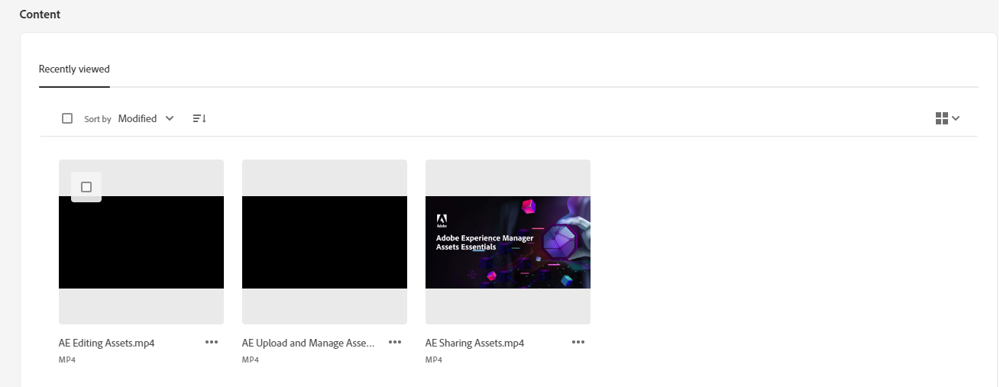
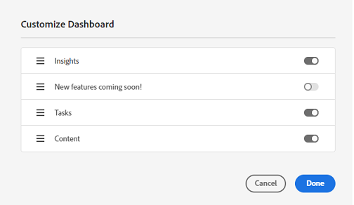

# Min arbetsyta för resurser {#my-workspace}

Resurserna innehåller nu en anpassningsbar arbetsyta med widgetar som du kan använda för att enkelt få tillgång till viktiga delar av användargränssnittet och den information som är mest relevant för dig. Den här sidan är en helhetslösning som ger en översikt över dina arbetsobjekt och ger snabb åtkomst till viktiga arbetsflöden. Mer lättåtkomlig åtkomst till dessa alternativ ökar effektiviteten och ökar innehållets hastighet.

Du kommer åt Min arbetsyta genom att klicka **[!UICONTROL My Workspace]** från de objekt som är tillgängliga i den vänstra navigeringsrutan. Min arbetsyta innehåller en mängd widgetar som visar de nya funktioner som snart kommer, insikter, uppgifter och innehållswidgetar. Du kan konfigurera hur dessa widgetar visas på arbetsytan utifrån dina inställningar.

>[!NOTE]
>
>Widgeten Insights är bara synlig för administratörer.

**Nya funktioner kommer snart**

Framtidens funktioner för Assets.

**Insikter**

Administratörer kan visa en sammanfattning av antalet hämtningar och överföringar som har gjorts i Assets-miljön under de senaste 30 dagarna. Du kan klicka **[!UICONTROL View all]** för att snabbt navigera till Insights-sidan för mer detaljerade instrumentpaneler.

**Uppgifter**

Visar en lista över uppgifter som för närvarande är tilldelade dig i **[!UICONTROL My Tasks]** -fliken, som du har skapat i **[!UICONTROL Assigned tasks]** och de uppgifter som du redan har slutfört i **[!UICONTROL Completed]** -fliken. Du kan välja en uppgift och klicka på **[!UICONTROL Complete Task]** för att godkänna eller avvisa en uppgift. Du kan också välja en uppgift och klicka på **[!UICONTROL Open Task Details]** om du vill visa uppgiften och godkänna, avvisa, redigera eller ta bort den.

>[!NOTE]
>
> The **[!UICONTROL Assign Tasks]** kan du tilldela en uppgift för en resurs till en annan användare när du markerar en resurs eller när du öppnar vyn med resursinformation.

**Innehåll**

Visar utvalda vyer av resurser, inklusive en lista över resurser som du nyligen har visat. Du kan välja att visa resurser i widgeten i en listvy, stödrastervy, gallerivy eller vattenfallsvy och sortera resurserna efter namn, storlek och ändringsdatum. Du kan också välja en resurs om du vill visa resursinformationen eller ta bort den från listan över nyligen visade resurser.

## Anpassa min arbetsyta {#configure-widgets}

Alla widgetar visas som standard, men du kan aktivera eller inaktivera de widgetar som visas i Min arbetsyta. Inställningarna är specifika för varje användare.

1. Klicka **[!UICONTROL My Workspace]** finns i den vänstra navigeringsrutan och klickar på **[!UICONTROL Customize]**.

1. Stäng av växlingsknappen för widgeten som du inte behöver visa på arbetsytan. Du kan också dra en widget till en lämplig plats för att uppdatera dess visningsordning på arbetsytan.

1. Klicka **[!UICONTROL Done]** för att spara ändringarna.

   
