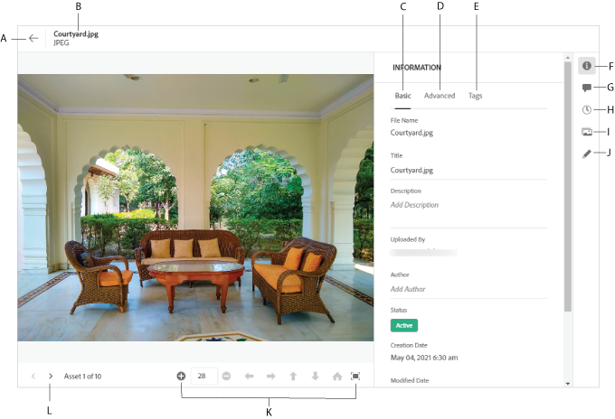

# Navigera till filer och mappar och visa resurser {#view-assets-and-details}

<!-- TBD: Give screenshots of all views with many assets. Zoom out to showcase how the thumbnails/tiles flow on the UI in different views. -->

<!-- TBD: The options in left sidebar may change. Shared with me and Shared by me are missing for now. Update this section as UI is updated. -->

## Förstå användargränssnittet för [!DNL Assets Essentials] {#understand-interface-navigation}

[!DNL Assets Essentials] har ett intuitivt och användarvänligt gränssnitt. Det rena gränssnittet gör det enkelt att hitta och komma ihåg resurser och relaterad information.

När du loggar in på [!DNL Assets Essentials] visas följande gränssnitt.

<!-- TBD: Update this screenshot. Remove top bar. Remove 2 labels from top bar. -->

![[!DNL Assets Essentials] användargränssnitt](assets/essentials-interface1.png)

*Bild: Första inloggningsskärmen och var du hittar de utjämnade funktionerna.*
     *S: Med vänster sidofält kan du bläddra i databasen och få tillgång till några andra alternativ.*
     *B: Visa eller dölj det vänstra sidfältet för att öka resursens visningsområde.*
     *C: Filtrera sökresultat.*
     *D: Sökruta.*
     *E: Alternativ för att sortera resurser.*
     *F: Ge feedback.*
     *G: Redigera dina användarinställningar eller logga ut.*
     *H: Växla mellan olika vyer.*

<!-- TBD: Need an embedded video here with narration. It has to be hosted on MPC to be embeddable. -->

## Bläddra bland och visa resurser och mappar {#browse-repository}

Du kan bläddra till önskade filer eller mappar från huvudanvändargränssnittet eller från vänster sidofält. När du bläddrar kan du använda gränssnittet för att visa miniatyrbilder av resurser för att visuellt bläddra i databasen eller visa resursinformation för att snabbt hitta den resurs du vill ha. De alternativ som är tillgängliga i den vänstra sidlisten är:

* **Resurser**: Lista över alla mappar och resurser i en trädvy som du har åtkomst till.
* **Senast visade**: Lista över resurser som du nyligen har förhandsgranskat. [!DNL Assets Essentials] visar bara de resurser som du förhandsgranskar. Här visas inte de resurser som du bläddrar förbi när du bläddrar bland databasfilerna eller databasmapparna.
* **Bibliotek**: Åtkomst till  [!DNL Adobe Creative Cloud Team] (CCT) Libraries-vyn. Den här vyn är bara synlig om användaren är berättigad till CCT-bibliotek.

<!-- TBD: My Work Space shows task inbox and it is not visible on AEM Cloud Demos as of now. It is the source of truth server hence not documenting My Work Space option for now.
-->

Du kan öppna eller komprimera det vänstra sidofältet om du vill öka det tillgängliga området för visning av resurser.

I [!DNL Assets Essentials] kan du visa resurser, mappar och sökresultat i fyra olika typer av layouter.

*  [!UICONTROL List View]
*  [!UICONTROL Grid View]
*  [!UICONTROL Gallery View]
*  [!UICONTROL Waterfall View]

Om du vill hitta en resurs kan du sortera resurserna i stigande eller fallande ordning `Name`, `Relevancy`, `Size`, `Modified` och `Created`.

Om du vill navigera till en mapp dubbelklickar du på mappens miniatyrbilder eller väljer mappen från vänster sidopanel. Om du vill visa information om en mapp markerar du den och klickar på Information i verktygsfältet högst upp. Om du vill navigera uppåt och nedåt i hierarkin använder du vänster sidospalt eller de synliga spåren högst upp.

*Bild: Om du vill bläddra i hierarkin använder du de synliga kolumnerna högst upp eller det vänstra sidofältet.*

## Förhandsgranska resurser {#preview-assets}

Innan du använder, delar eller hämtar en resurs kan du visa den närmare. Med förhandsvisningsfunktionen kan du visa inte bara bilderna utan även några andra resurstyper som stöds.

Om du vill förhandsgranska en resurs markerar du den och klickar på [!UICONTROL Details]  i verktygsfältet högst upp. Du kan inte bara visa resursen utan även visa detaljerade metadata och vidta andra åtgärder.

*S: Återgå till aktuell mapp eller aktuellt sökresultat i databasen.*
*B: Namn och format för filen som du förhandsgranskar.*
*C: Grundläggande metadata.*
*D: Avancerade metadata.*
*E: Nyckelord och smarta taggar.*
*F: Förhandsgranska resurs och se metadatainformation.*
*G: Kommentera och kommentera.*
*H: Visa och hantera versioner.*
*I: Visa återgivningar av bilden.*
*J: Redigera bild.*
*K: Förhandsgranska mer ingående. Zooma, helskärmsläge och andra alternativ.*
*L: Gå till föregående eller nästa resurs i den aktuella mappen utan att gå tillbaka till mappen.*

<!-- TBD: Describe the options.

Explicitly previewed assets are displayed as recently viewed assets. Give screenshot of this.
Other use cases after previewing.

-->

>[!MORELIKETHIS]
>
>* [Visa versioner av en resurs](/help/manage-organize.md#view-versions).

