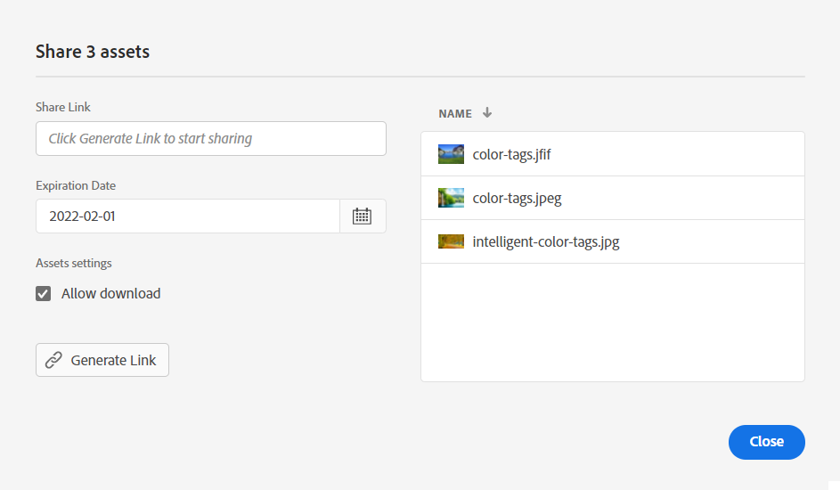

# Dela länkar för resurser {#share-links-assets}

[!DNL Assets Essentials] gör att du kan skapa en länk och dela resurser med externa intressenter som inte har tillgång till [!DNL Assets Essentials] program. Du kan definiera:

* Ett förfallodatum för länken

* Om mottagarna får ladda ned resurserna (ursprungliga binärfiler) efter att de har öppnat länken.

Baserat på de här inställningarna kan mottagaren av länken välja att förhandsgranska resurserna eller hämta dem.

## Generera en länk för resurser {#generate-link-for-assets}

Så här skapar du en länk för en resurs eller en mapp som innehåller resurser:

1. Markera de resurser och/eller mappar som innehåller resurser och klicka på **[!UICONTROL Share Link]**.

1. Om du vill justera den klickar du på kalenderikonen för att definiera ett förfallodatum för länken med hjälp av **[!UICONTROL Expiration Date]** fält. Du kan också ange ett datum direkt i dialogrutan `yyyy-mm-dd` format. Som standard är förfallodatumet för en länk inställt på två veckor från delningsdatumet.

1. Välj **[!UICONTROL Allow download]** för att tillåta att mottagaren av länken hämtar resurser.

1. Klicka på **[!UICONTROL Generate Link]**.

1. Klicka **[!UICONTROL Copy Link]** för att kopiera länken. Du kan också kopiera länken från **[!UICONTROL Share Link]** fält.

   

1. Klicka **[!UICONTROL Close]** och dela länken via e-post eller andra samarbetsverktyg.

## Åtkomst till delade resurser {#access-shared-assets}

När mottagarna har delat den offentliga länken för resurserna kan de klicka på länken för att förhandsgranska eller hämta de delade resurserna i en webbläsare utan att behöva logga in på [!DNL Assets Essentials].

Klicka på länken, klicka på mappen för att navigera till resursen och klicka sedan på resursen för att förhandsgranska den. Du kan välja att visa de delade resurserna i en listvy eller en kortvy.

Du kan hålla muspekaren över den delade resursen eller den delade resursmappen för att antingen välja resursen eller hämta den.

Du kan också markera flera resurser och klicka på **[!UICONTROL Download]**. [!DNL Assets Essentials] hämtar de markerade resurserna som en zip-fil. [!DNL Assets Essentials] skapar en undermapp i den överordnade ZIP-filen, med samma namn som resursen, för varje resurs som du väljer att hämta.

Om du vill hämta alla resurser samtidigt växlar du till **[!UICONTROL List view]**, klicka **[!UICONTROL Select all]** och sedan klicka **[!UICONTROL Download]**.

>[!NOTE]
>
>Om du inte aktiverar nedladdningsalternativet när [skapa länken](#share-links-assets) för en resurs och om mottagaren av länken väljer att hämta resursen, [!DNL Assets Essentials] hämtar en tom zip-fil.

