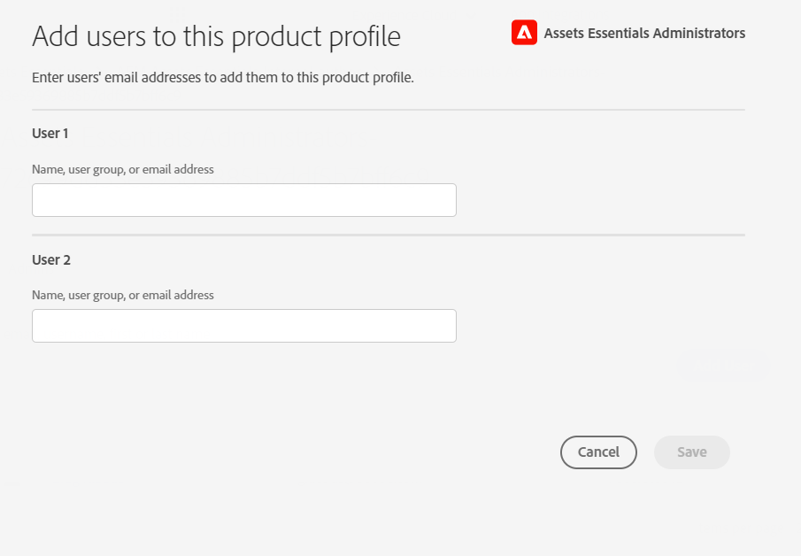

# Administrera Experience Manager Assets Essentials {#administer-assets-essentials}

## Syfte

* **Målgrupp**: Assets Essentials-administratörer

* **Mål**: Konfigurera åtkomsten till programmet Assets Essentials med Admin Console och hantera sedan de åtgärder som kan utföras efter att du loggat in till programmet Assets Essentials.

## Ökning {#overview}

[!DNL Adobe Experience Manager Assets Essentials] har etablerats av Adobe för sina kunder. Som en del av etableringen läggs [!DNL Assets Essentials] till i en kunds organisation i [!DNL Adobe Admin Console]. Administratörer använder [!DNL Admin Console] för att hantera användarberättiganden för lösningen [!DNL Assets Essentials] och tilldela programadministratörer för att konfigurera behörigheter och metadataformulär i [!DNL Assets Essentials].

I följande dataflödesdiagram visas de åtgärder som en administratör måste utföra för att konfigurera och hantera Assets Essentials:

## Gå till Admin Console {#access-admin-console}

När Assets Essentials har etablerats får administratören ett e-postmeddelande från Adobe. E-postmeddelandet innehåller ett välkomstmeddelande och en länk för att komma igång. Dessutom startar Adobe processen att distribuera Assets Essentials automatiskt. Distributionsprocessen tar en timme att slutföra.

Från länken i e-postmeddelandet kan du komma åt och logga in på [Admin Console](https://adminconsole.adobe.com). Om du har administratörsåtkomst till mer än ett organisationskonto väljer du lämplig organisation eller växlar till den med [organisationsväljaren](https://helpx.adobe.com/se/enterprise/using/admin-console.html). När den automatiska distributionsprocessen är slutförd visas produktkortet för [!DNL AEM Assets Essentials] i [!DNL Admin Console].

## Hantera uppgifter i Admin Console {#manage-admin-console-tasks}

Utför följande uppgifter i Admin Console:

* [Lägga till användare i produktprofiler](#add-users-to-product-profiles)

* [Lägg till användargrupper](#add-user-groups)

* [Lägga till användare i grupper](#add-users-to-user-groups)

### Lägga till användare i produktprofiler {#add-users-to-product-profiles}

Lägg till användare i produktprofiler så att de har tillgång till programmet Assets Essentials.

Så här lägger du till användare i produktprofiler:

1. Gå till [Admin Console](https://adminconsole.adobe.com) för din organisation, klicka på **[!UICONTROL Products]** i det övre fältet, klicka på **[!UICONTROL AEM Assets Essentials]** och klicka sedan på instansen för [!DNL Assets Essentials]. Namnet på instansen kan skilja sig från skärmbilden nedan.
   >[!NOTE]
   >
   >[!DNL Cloud Manager]-instansen är avsedd för särskild admin och kan bara användas för att kontrollera tjänstens status och få åtkomst till tjänstloggar. Den kan inte användas för att lägga till användare i produkten. Mer information finns i [Administratörshandboken](deploy-administer.md#view-service-status-and-access-logs-view-logs).

   

   [!DNL Assets Essentials] har tre produktprofiler som representerar åtkomst för administratörer, vanliga användare och konsumentanvändare.

   

1. Om du vill lägga till en användare i Assets Essentials klickar du på någon av de tre produktprofilerna, väljer **[!UICONTROL Add User]**, anger användarinformation och klickar på **[!UICONTROL Save]**.

   

   När du lägger till en användare får användaren en e-postinbjudan om att komma igång. Du kan inaktivera e-postinbjudningar i inställningarna för produktprofilen i [!DNL Admin Console].

1. Om du vill ta bort en användare från en grupp klickar du på gruppen, markerar en befintlig användare och väljer **[!UICONTROL Remove User]**.

   >[!NOTE]
   >
   >Du måste lägga till en användare i administratörens Assets Essentials produktprofil på Admin Console för att kunna utföra administrativa uppgifter i Assets Essentials. De här åtgärderna omfattar [Skapa mappstruktur](#create-folder-structure), [Hantera behörigheter för mappar](#manage-permissions-for-folders) och [Konfigurera metadata för Forms](#metadata-forms).

### Lägg till användargrupper {#add-user-groups}

Skapa användargrupper och tilldela sedan användarna till användargrupperna. De här användargrupperna är tillgängliga i programmet Assets Essentials för att ange behörigheter för mappar.

Du kan lägga till användare i användargrupper (1) och [användare i produktprofiler för Assets Essentials (2)](#add-admin-users). Du kan dock inte lägga till användargrupper direkt i Assets Essentials produktprofiler (3).

Mer information om hur du hanterar användargrupper finns i `Create user groups` och `Edit user groups` på [Hantera användargrupper](https://helpx.adobe.com/se/enterprise/using/user-groups.html).

>[!NOTE]
>
>Om Admin Console är konfigurerat för att utnyttja ett externt system för att hantera användare/grupper-tilldelningar, till exempel Azure- eller Google-anslutningar, användarsynkroniseringsverktyg eller API för användarhanteringsmål, konfigureras dina grupper och användartilldelningar automatiskt. Mer information finns i [Adobe Admin Console-användare](https://helpx.adobe.com/se/enterprise/using/users.html).

### Lägga till användare i grupper {#add-users-to-user-groups}

När du har skapat användargrupper kan du börja lägga till användare i användargrupper.

Mer information om hur du hanterar tillägg av användare i användargrupper finns i `Add users to groups` på [Hantera användargrupper](https://helpx.adobe.com/in/enterprise/using/user-groups.html#add-users-to-groups).

## Hantera administrationsåtgärder för Assets Essentials {#manage-assets-essentials-tasks}

När du har utfört Admin Console-åtgärderna kan du nu utföra följande administrationsåtgärder i programmet Assets Essentials:

* [Skapa mappstruktur](#create-folder-structure)

* [Hantera behörigheter för mappar](#manage-permissions-for-folders)

* [Konfigurera metadata-Forms](#metadata-forms)

>[!NOTE]
>
>För att kunna hantera dessa uppgifter, särskilt att hantera behörigheter, måste din användare ha programadministrationsbehörighet. Den måste läggas till i produktprofilen [Administrator Assets Essentials](#add-users-to-product-profiles).

### Skapa mappstruktur {#create-folder-structure}

Du kan använda följande metoder för att skapa en mappstruktur i Assets Essentials databas:

* Klicka på alternativet **[!UICONTROL Create Folder]** i verktygsfältet för att skapa en tom mapp.

* Klicka på alternativet **[!UICONTROL Add Assets]** i verktygsfältet för att [överföra en mappstruktur som är tillgänglig på den lokala datorn](add-delete.md).

Skapa en mappstruktur som fungerar bra med organisationens affärsmål. Om du överför en befintlig mappstruktur till Assets Essentials databas bör du granska strukturen. Mer information finns i [Bästa tillvägagångssätt för effektiv behörighetshantering](permission-management-best-practices.md).

Tänk på följande när du börjar planera för att skapa en mappstruktur i Assets Essentials-databasen:

* Framtida styrning: Mapparna som styrs av administratörer och mapparna som har [delegerats för behörighet till andra användare som ägare](manage-permissions.md##manage-permissions-folders).

* Skalbar: Mappstrukturen bör vara anpassad efter organisationens framtida behov och bör vara enkel att skala.

* Storlek: En mapp får inte innehålla för många resurser. Det kan leda till användbarhetsproblem och kan bli svårt att hantera.

* Intuitiv: Mappstrukturen bör vara enkel att bläddra i och intuitiv för slutanvändarna. Användare bör enkelt kunna identifiera var en ny resurs ska överföras i mappstrukturen.

Det finns olika mappstrukturtyper som du kan använda för din organisation. Nedan följer några exempel på typiska mappstrukturer:

### Hantera behörigheter för mappar {#manage-permissions-for-folders}

I Assets Essentials kan administratörer hantera åtkomstnivåerna för de mappar som är tillgängliga i databasen. Som administratör kan du skapa användargrupper och tilldela behörigheter till dessa grupper för att hantera åtkomstnivåer. Du kan även delegera behörighetshanteringsprivilegier till användargrupper på mappnivå.

>[!VIDEO](https://video.tv.adobe.com/v/341104)

Mer information finns i [Hantera behörigheter för mappar](manage-permissions.md).

### Konfigurera metadata-Forms {#metadata-forms}

Assets Essentials tillhandahåller många standardmetadatafält som standard. Organisationer har ytterligare metadatabehov och behöver fler metadatafält för att kunna lägga till företagsspecifika metadata. Med metadataformulär kan företag lägga till anpassade metadatafält på sidan [!UICONTROL Details] för en resurs. De företagsspecifika metadata förbättrar styrningen och identifieringen av dess resurser. Du kan skapa formulär från grunden eller återanvända befintliga formulär.

Du kan konfigurera metadataformulär för olika typer av resurser (olika MIME-typer). Använd samma formulärnamn som filens MIME-typ. Med Essentials matchas automatiskt MIME-typen för överförda resurser mot namnet på formuläret och metadata för överförda resurser uppdateras baserat på formulärfälten.

Om det till exempel finns ett metadataformulär med namnet `PDF` eller `pdf` innehåller de överförda PDF-dokumenten metadatafält som definierats i formuläret.

Assets Essentials använder följande sekvens för att söka efter befintliga metadataformulärnamn för att tillämpa metadatafälten på de överförda resurserna av en viss typ:

MIME-undertyp > MIME-typ > `default`-formulär > Formulär som inte finns i kartongen

Om det till exempel finns ett metadataformulär med namnet `PDF` eller `pdf` innehåller de överförda PDF-dokumenten metadatafält som definierats i formuläret. Om det inte finns något metadataformulär med namnet `PDF` eller `pdf` matchar Assets Essentials om det finns ett metadataformulär med namnet `application`. Om det finns ett metadataformulär med namnet `application` innehåller de överförda PDF-dokumenten metadatafält som definierats i formuläret. Om Assets Essentials fortfarande inte hittar något matchande metadataformulär söker programmet efter metadataformuläret `default` för att tillämpa metadatafält som definierats i formuläret på de överförda PDF-dokumenten. Om inget av dessa steg fungerar använder Assets Essentials metadatafält som är definierade i det färdiga formuläret för alla överförda PDF-dokument.

>[!IMPORTANT]
>
>Det nya metadataformuläret för en viss filtyp ersätter helt standardmetadataformuläret som [!DNL Assets Essentials] tillhandahåller. Om du tar bort eller byter namn på ett metadataformulär är standardmetadatafälten igen tillgängliga för nya resurser.

>[!VIDEO](https://video.tv.adobe.com/v/341275)

Mer information om Metadata Forms finns i [Metadata Forms i Assets Essentials](metadata.md#metadata-forms).

## What&#39;s Next

Nu när du har konfigurerat och hanterat Assets Essentials-programmet kan [integrera Creative Cloud-program med Experience Manager Assets Essentials-programmet](integrate-assets-essentials-creative-cloud.md).
