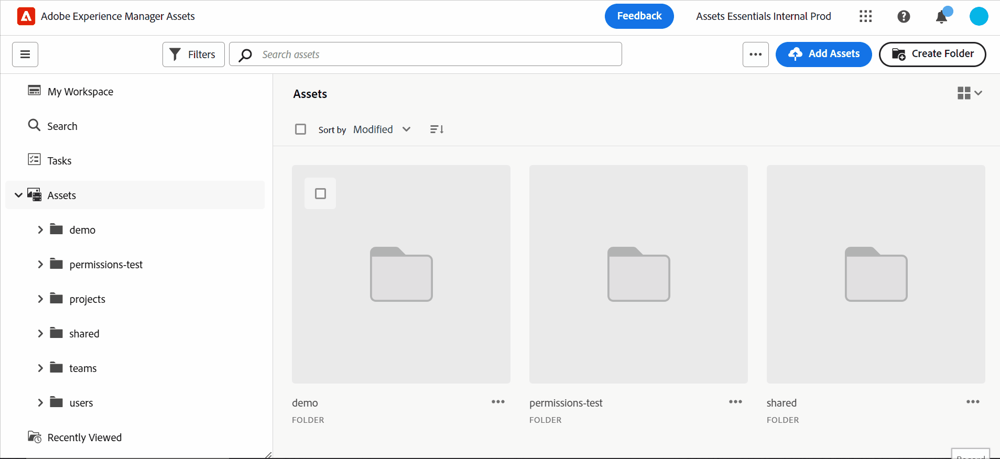

# Introduktion till resursvyn {#assets-view}

I dagens snabba digitala första landskap, där det är viktigt att skapa och leverera innehåll i realtid, är en DAM-upplevelse (Digital Asset Management) som är utformad för att snabba upp marknadsföringen längre fram i kedjan oerhört viktig. Adobe, som utnyttjar sin expertis inom marknadsföring och kreativa yrkesverksamma, introducerar en ny omvälvande upplevelse i Assets View. Det här arbetsflödet i första hand revolutionerar hur företag hanterar sina dynamiska digitala resurser och ger marknadsförarna möjlighet att maximera effektiviteten när det gäller att hitta, samarbeta, personalisera och leverera resurser. Dessa smidiga arbetsflöden snabbar upp innehållets hastighet och lyfter era marknadsföringssatsningar till nya höjder.

## Hur får du åtkomst till resursvyn? {#access-assets-view}

Du kommer åt resursvyn på följande sätt:

* **Växla i administrationsvyn**

   * Logga in [!DNL Experience Manager] med Cloud Manager.
   * Navigera till **[!UICONTROL Assets]** > **[!UICONTROL Files]**.
   * Klicka på profilikonen i det övre högra hörnet.
   * Klicka **[!UICONTROL Switch View]** från **[!UICONTROL Profile Settings]** -avsnitt.
Upprepa dessa steg för att växla tillbaka till administrationsvyn.

* **Produktväljare**
   * Logga in [!DNL Experience Manager] och klicka
   * Välj **[!UICONTROL Experience Manager Assets]** för att öppna resursvyn.
   * Välj **[!UICONTROL Experience Manager]** för att komma åt administratörsvyn.

* **Snabblänkar**
   * Logga in på experience.adobe.com.
   * Klicka **[!UICONTROL Experience Manager Assets]** för att öppna resursvyn.
   * Klicka **[!UICONTROL Experience Manager Assets]** för att öppna resursvyn.

## Kontrollpanelen Min arbetsyta för att skapa effektiva upplevelser

Säg hej till en Digital Asset Management-lösning som förstår de olika behoven i olika organisationsroller. Den nya smidiga Assets View prioriterar användarvänlighet och snabbhet och följer marknadsförarnas önskemål om visuella tilltalande och rena arbetsytor. Med en anpassningsbar användarspecifik kontrollpanel för Min arbetsyta kan marknadsförarna snabbt hitta, förhandsgranska, redigera, hantera och leverera resurser med enastående effektivitet. Anlita en oändlig tid på att leta efter specifika resurser och välkomna en smidig upplevelse som ger dig allt du behöver nära till hands.

## Sökning i första rummet för ökad effektivitet

Utnyttja potentialen i organisationens digitala resursbibliotek med kraftfulla sökfunktioner. Du kan lägga ett bra bud om du vill gå igenom en mängd olika filer och mappar manuellt. Alla användare kan direkt hitta den perfekta bild, video eller det dokument ni behöver för att skapa fantastiska marknadsföringskampanjer, fängslande presentationer och engagerande innehåll. Med vår första sökmotor kan du enkelt navigera bland resurstyper, metadata, smarta taggar och till och med själva innehållet utan att kunna det exakta nyckelordet. Ge liv åt DAM:s framtid med Search-First och utnyttja hela potentialen i ert digitala resursbibliotek.

## Insikter för att fatta datadrivna beslut {#insights-data}

För att hålla jämna steg med innehållets hastighet är användbara insikter viktiga. Den nya resursvyn ger avancerade insikter på arbetsytan Min arbetsyta och ger värdefulla data om resursprestanda, målgruppsanvändning och engagemang. Marknadsförarna kan fatta datadrivna beslut, optimera innehållsstrategier och förfina leveransen i efterföljande led för att få optimala resultat. Med tillgång till meningsfulla insikter kan företag ligga steget före konkurrenterna och få exceptionella resultat.

## Adobe Photoshop Express-integration snabbar upp samarbetet {#accelerate-collaboration}

Den nya upplevelsen innehåller en robust uppsättning samarbetsfunktioner, inklusive redigering i realtid med inbyggda Adobe Photoshop-funktioner, versionskontroller och anteckningsverktyg. Detta möjliggör smidigt samarbete mellan design-, design-, varumärkes- och marknadsföringsteam, så att de kan övervinna flaskhalsar och snabba upp processen för marknadsföringsåtgärder. Nu har marknadsförarna kraftfulla verktyg till sitt förfogande för att snabba upp projektleveransen och öka produktiviteten.

I den här videon ser du hur väl Assets-vyn har integrerats med Adobe Photoshop Express:

>[!VIDEO](https://video.tv.adobe.com/v/3420922)

## Mappöverföringar för att konfigurera hierarkisk struktur för din organisation {#folder-uploads}

Konfigurera snabbt en mappstruktur för organisationen med resursvyn genom att överföra mappar som finns i det lokala filsystemet. Du behöver inte skapa mappar under rotmappen och sedan överföra resurser till dessa mappar manuellt för att behålla den logiska hierarkiska strukturen. Alla mappar och resurser under rotmappen överförs automatiskt till Experience Manager Assets.

## Prenumerera på databasinnehåll för effektiv resurshantering

I resursvyn kan du övervaka åtgärder som utförs på de resurser, mappar eller samlingar som är tillgängliga i databasen. Du måste välja och prenumerera på det innehåll som meddelandena skickas till dig för. Du kan också konfigurera händelsetyperna, till exempel borttagning av det innehåll du prenumererar på, ändringar av det innehåll du prenumererar på och så vidare. Meddelandena skickas sedan bara till dig för de händelsetyperna.

## Mjuk borttagning av resurser för bättre kontroll till administratörer {#soft-delete-assets}

I papperskorgen som är tillgänglig i resursvyn visas de resurser som tagits bort från rotresursmappen. Du kan välja en resurs i papperskorgen om du vill återställa den till den ursprungliga platsen eller ta bort den permanent. Du kan också ange ett nyckelord eller använda standardfilter eller anpassade filter för att söka efter lämpliga resurser i papperskorgen.

Förutom dessa funktioner kan du även använda resursvyn för att utföra följande funktioner som inte är tillgängliga i administrationsvyn:

* Överför en ny version av en resurs med ett annat namn från det lokala filsystemet till resurskatalogen. Den överförda resursen är tillgänglig som en ny version med samma namn som den ursprungliga resursen.

* Byt namn på resurser och mappar som är tillgängliga i databasen.

## Slutsats {#conclusion}

Det är dags att omvandla våra marknadsföringsverktyg för att stödja det föränderliga affärslandskapet. Den nya vyn Adobe Experience Manager Assets Assets View är skräddarsydd för att effektivisera arbetsflöden, främja samarbete och snabba upp materialleveranserna. Genom att anamma innehållets snabbhet kan marknadsförarna utnyttja hela potentialen i sitt digitala material och frigöra kreativiteten som aldrig förr. Gör er redo att utnyttja kraften i Adobe nya Assets Visa upplevelsen och få exceptionella resultat i era marknadsföringskampanjer. Det är dags att ta till sig framtiden för DAM och driva verksamheten framåt.

