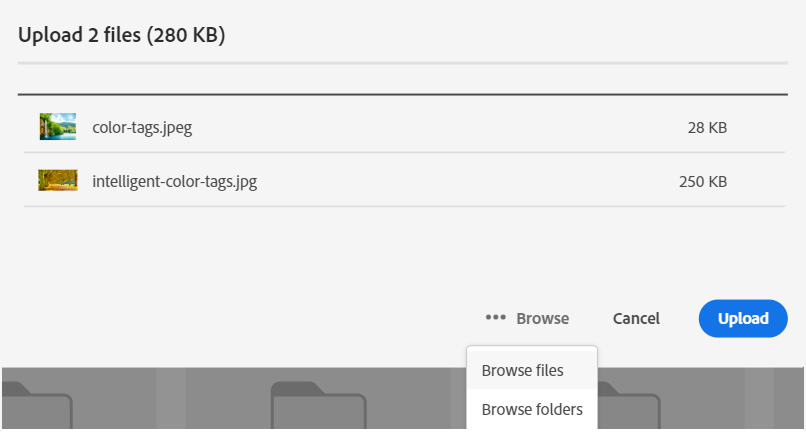

# Administrera [!DNL Assets Essentials] och lägg till användare {#administer}

[!DNL Adobe Experience Manager Assets Essentials] har etablerats av Adobe för sina kunder. Som en del av etableringen läggs [!DNL Assets Essentials] till i en kunds organisation i [!DNL Adobe Admin Console]. Administratörer använder [!DNL Admin Console] för att hantera användarberättiganden för lösningen [!DNL Assets Essentials] och tilldela programadministratörer för att konfigurera behörigheter och metadataformulär i [!DNL Assets Essentials].

I följande dataflödesdiagram visas de åtgärder som en administratör måste utföra för att konfigurera och hantera Assets Essentials:

## Gå till Admin Console {#access-admin-console}

När Assets Essentials har etablerats får administratören ett e-postmeddelande från Adobe. E-postmeddelandet innehåller ett välkomstmeddelande och en länk för att komma igång. Dessutom startar Adobe processen att distribuera Assets Essentials automatiskt. Distributionsprocessen tar en timme att slutföra.

Från länken i e-postmeddelandet kan du komma åt och logga in på [Admin Console](https://adminconsole.adobe.com). Om du har administratörsåtkomst till mer än ett organisationskonto väljer du lämplig organisation eller växlar till den med [organisationsväljaren](https://helpx.adobe.com/se/enterprise/using/admin-console.html). När den automatiska distributionsprocessen är slutförd visas produktkortet för [!DNL AEM Assets Essentials] i [!DNL Admin Console].

Utför följande åtgärder för användartillstånd med Admin Console:

* [Skapa programadministratör för Assets Essentials](#create-assets-essentials-administrator)

* [Lägg till användargrupper](#add-user-groups)

* [Lägga till användargrupper i produktprofiler](#add-users-to-product-profiles)

### Skapa programadministratör för Assets Essentials {#create-assets-essentials-administrator}

En Admin Console-administratör måste lägga till Assets Essentials administratörsproduktprofil för en användare och inte för en användargrupp. Programadministratören i Assets Essentials kan sedan hantera uppgifter som att skapa en mappstruktur, överföra resurser, konfigurera behörigheter, konfigurera metadataformulär och skapa offentliga samlingar. Mer information om hur du tilldelar en Assets Essentials-programadministratörsprofil till en användare finns i [Lägga till produktprofiler i användargrupper](#add-product-profiles-to-user-groups).

### Lägg till användargrupper {#add-user-groups}

Skapa användargrupper och tilldela sedan användarna till användargrupperna. De här användargrupperna är tillgängliga i programmet Assets Essentials för att ange behörigheter för mappar.

Mer information om hur du hanterar användargrupper finns i `Create user groups` och `Edit user groups` på [Hantera användargrupper](https://helpx.adobe.com/se/enterprise/using/user-groups.html).

>[!NOTE]
>
>Om Admin Console är konfigurerat för att utnyttja ett externt system för att hantera användare/grupper-tilldelningar, till exempel Azure- eller Google-anslutningar, användarsynkroniseringsverktyg eller API för användarhanteringsmål, konfigureras dina grupper och användartilldelningar automatiskt. Mer information finns i [Adobe Admin Console-användare](https://helpx.adobe.com/se/enterprise/using/users.html).

Mer information om hur du hanterar tillägg av användare i användargrupper finns i `Add users to groups` på [Hantera användargrupper](https://helpx.adobe.com/in/enterprise/using/user-groups.html#add-users-to-groups).

### Lägga till produktprofiler i användargrupper {#add-product-profiles-to-user-groups}

Lägg till produktprofiler i användargrupper så att de har tillgång till Assets Essentials.

Så här lägger du till produktprofiler i användargrupper:

1. Gå till [Admin Console](https://adminconsole.adobe.com) för din organisation, klicka på **[!UICONTROL Products]** i det övre fältet, klicka på **[!UICONTROL AEM Assets Essentials]** och klicka sedan på instansen för [!DNL Assets Essentials]. Namnet på instansen kan skilja sig från skärmbilden nedan.
   >[!NOTE]
   >
   >[!DNL Cloud Manager]-instansen är avsedd för särskild admin och kan bara användas för att kontrollera tjänstens status och få åtkomst till tjänstloggar. Den kan inte användas för att lägga till användare i produkten.

   

   [!DNL Assets Essentials] har tre produktprofiler som representerar åtkomst för administratörer, vanliga användare och konsumentanvändare.

   * **[!DNL Assets Essentials]Administratörer** har administrativ åtkomst till programmet. Utöver alla slutanvändarfunktioner kan programadministratörer i den här gruppen hantera behörigheter för alla mappar och grupper/användare i hela programdatabasen.

   * **[!DNL Assets Essentials]användare** har tillgång till det fullständiga användargränssnittet. Dessa användare kan överföra, ordna, tagga och hitta digitala resurser.

   * **[!DNL Assets Essentials]Konsumentanvändare** kan söka, förhandsvisa och hämta åtgärder i Assets Essentials. De kan också söka efter och välja resurser i Adobe Journey Optimizer och söka efter och välja resurser som ska användas i Workfront.
Mer information finns i [Integrering med andra lösningar](integration.md).

   

1. Om du vill lägga till en användargrupp i Assets Essentials klickar du på någon av de tre produktprofilerna, väljer **[!UICONTROL Add User]**, anger användargruppsinformation och klickar på **[!UICONTROL Save]**.

   

   När du lägger till en användare får användaren en e-postinbjudan om att komma igång. Du kan inaktivera e-postinbjudningar i inställningarna för produktprofilen i [!DNL Admin Console].

   >[!NOTE]
   >
   >Du måste lägga till en användare i administratörens Assets Essentials produktprofil på Admin Console för att kunna utföra administrativa uppgifter i Assets Essentials. De här åtgärderna omfattar [Skapa mappstruktur](#create-folder-structure), [Hantera behörigheter för mappar](#manage-permissions-for-folders) och [Konfigurera metadata för Forms](#metadata-forms).

## Access Assets Essentials {#access-assets-essentials-application}

När du har utfört användarberättiganden i Admin Console kan du använda programmet Assets Essentials för att utföra följande uppgifter:

* [Skapa mappstruktur](#create-folder-structure)

* [Överför resurser](#upload-assets)

* [Hantera behörigheter för mappar](#manage-permissions-for-folders)

* [Konfigurera metadata-Forms](#metadata-forms)

* [Skapa offentliga samlingar](#create-public-collections)

### Skapa mappstruktur {#create-folder-structure}

Du kan använda följande metoder för att skapa en mappstruktur i Assets Essentials databas:

* Klicka på alternativet **[!UICONTROL Create Folder]** i verktygsfältet för att skapa en tom mapp.

* Klicka på alternativet **[!UICONTROL Add Assets]** i verktygsfältet för att [överföra en mappstruktur som är tillgänglig på den lokala datorn](add-delete.md).

Skapa en mappstruktur som fungerar bra med organisationens affärsmål. Om du överför en befintlig mappstruktur till Assets Essentials databas bör du granska strukturen. Mer information finns i [Bästa metoder för mappstruktur för effektiv behörighetshantering](permission-management-best-practices.md##folder-structure-assets-essentials).

Det finns olika mappstrukturtyper som du kan använda för din organisation. Nedan följer några exempel på typiska mappstrukturer:

>[!NOTE]
>
>För att kunna hantera dessa uppgifter, särskilt att hantera behörigheter, måste din användare ha programadministrationsbehörighet. Den måste läggas till i produktprofilen [Administrator Assets Essentials](#add-users-to-product-profiles).

### Överför resurser {#upload-assets}

Om du vill lägga till nya resurser att arbeta med överför du några resurser från det lokala filsystemet. Du kan antingen dra resurser eller mappar i användargränssnittet och följa instruktionerna på skärmen eller klicka på alternativet **[!UICONTROL Add Assets]** i verktygsfältet och lägga till filer i överföringsdialogrutan. [!DNL Assets Essentials] erbjuder kraftfulla textsökningsfunktioner, men du kan också använda mappar för att ordna dina resurser bättre. Mer information finns i [Överför resurser](add-delete.md).

### Hantera behörigheter för mappar {#manage-permissions-for-folders}

I Assets Essentials kan administratörer hantera åtkomstnivåerna för de mappar som är tillgängliga i databasen. Som administratör kan du skapa användargrupper och tilldela behörigheter till dessa grupper för att hantera åtkomstnivåer. Du kan även delegera behörighetshanteringsprivilegier till användargrupper på mappnivå.

>[!VIDEO](https://video.tv.adobe.com/v/341104)

Mer information finns i [Hantera behörigheter för mappar](manage-permissions.md).

### Konfigurera metadata Forms (valfritt) {#metadata-forms}

Assets Essentials tillhandahåller många standardmetadatafält som standard. Organisationer har ytterligare metadatabehov och behöver fler metadatafält för att kunna lägga till företagsspecifika metadata. Med metadataformulär kan företag lägga till anpassade metadatafält på sidan [!UICONTROL Details] för en resurs. De företagsspecifika metadata förbättrar styrningen och identifieringen av dess resurser. Du kan skapa formulär från grunden eller återanvända befintliga formulär.

Du kan konfigurera metadataformulär för olika typer av resurser (olika MIME-typer). Använd samma formulärnamn som filens MIME-typ. Med Essentials matchas automatiskt MIME-typen för överförda resurser mot namnet på formuläret och metadata för överförda resurser uppdateras baserat på formulärfälten.

Om det till exempel finns ett metadataformulär med namnet `PDF` eller `pdf` innehåller de överförda PDF-dokumenten metadatafält som definierats i formuläret.

Mer information finns i [Metadataformulär](metadata.md#metadata-forms).

>[!VIDEO](https://video.tv.adobe.com/v/341275)

Mer information om Metadata Forms finns i [Metadata Forms i Assets Essentials](metadata.md#metadata-forms).

### Skapa publika samlingar (valfritt) {#create-public-collections}

En samling är en uppsättning resurser i Experience Manager Assets Essentials. Använd samlingar för att dela resurser mellan användare.

Till skillnad från mappar kan en samling innehålla resurser från olika platser. Du kan dela flera samlingar med en användare. Varje samling innehåller referenser till resurser. Resursernas referensintegritet bevaras i alla samlingar. Mer information finns i [Hantera samlingar](manage-collections.md).

## Nästa steg {#next-steps}

<!-- THIS URL IS A 404 ERROR; NO REDIRECT WAS PUT IN PLACE * [Watch a video to deploy Assets Essentials](https://experienceleague.adobe.com/docs/experience-manager-learn/assets-essentials/provisioning.html?lang=en) -->

* Ge produktfeedback med alternativet [!UICONTROL Feedback] som finns i användargränssnittet för Assets Essentials

* Ge feedback om dokumentationen med [!UICONTROL Edit this page]  eller [!UICONTROL Log an issue]  som är tillgängligt på den högra sidopanelen

* Kontakta [kundtjänst](https://experienceleague.adobe.com/sv?support-solution=General#support)

>[!MORELIKETHIS]
>
>* [[!DNL Admin Console] hjälp](https://helpx.adobe.com/se/enterprise/using/admin-console.html)
>* [[!DNL Cloud Manager] hjälp](https://experienceleague.adobe.com/docs/experience-manager-cloud-manager/using/introduction-to-cloud-manager.html?lang=sv-SE)
>* [Adobe Journey Optimizer-dokumentation](https://experienceleague.adobe.com/docs/journey-optimizer/using/ajo-home.html?lang=sv-SE)
>* [Versionsinformation](release-notes.md)
>* [Kom igång med  [!DNL Assets Essentials]](get-started.md)
