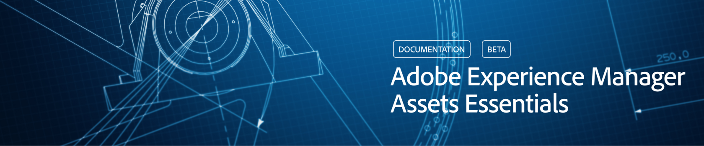

# [!DNL Adobe Experience Manager Assets Essentials] översikt {#assets-essentials}

<!-- 
TBD: Update this banner to remove Beta label. 

-->

Adobe erbjuder robusta DAM-lösningar (Digital Asset Management) så att ni får ut mesta möjliga av era digitala resurser. Adobe Experience Manager Assets Essentials är en lättviktig resurshanteringslösning från Adobe som används för att lagra, hantera, identifiera och använda digitala resurser.

## Vad är Assets Essentials? {#assets-essemtials-overview}

Experience Manager Assets Essentials är en lättviktsutgåva av Adobe Experience Manager Assets Cloud Service. Assets Essentials ger en enhetlig resurshantering och ett smidigt och modernt användargränssnitt. Den lättanvända lösningen gör att fler kreatörer och marknadsförare kan lagra, upptäcka och distribuera digitalt material.

Med Assets Essentials kan du:

* Hantera, ordna och styr resurser på en central plats.

* Samarbeta kring innehållsutveckling i olika team.

* Få tillgång till, söka efter och hitta godkända resurser.

* Dela och ladda ned material för leverans i efterföljande led.

## Hur får du tillgång till Assets Essentials? {#access-options}

Assets Essentials erbjuder ett fristående webbanvändargränssnitt för slutanvändare och administratörer som ger dem tillgång till alla lösningens funktioner. Användare av andra Adobe-lösningar kan även få tillgång till och arbeta med resurser från Assets Essentials via en inbäddad upplevelse som är tillgänglig i Creative Cloud för företag, Adobe Journey Optimizer och Adobe Workfront.

## Varför Assets Essentials? {#assets-essentials-features}

Resurser Essentials ger viktiga fördelar så att du kan:

* **Kom igång snabbt** med användningsklara resurshanteringsverktyg.

* Utöka åtkomsten till resurser till fler team för att leverera enhetliga kundupplevelser med **förenklad resurshantering**.

* Sammanställ innehållets livscykel med inbyggda **integreringar i andra Adobe-lösningar**.

* Utnyttja en **molnbaserad plattform**, säker och redo att skalas när som helst, var som helst.

* Börja med grundläggande DAM-funktioner och **utöka** till företags-DAM.

**Kom igång snabbt**

Resurser Essentials-lösningen tillhandahålls av Adobe och är tillgänglig när provisioneringsprocessen har slutförts. Administratörer får tillgång till produkten i Adobe Admin Console och kan omedelbart starta systemkonfiguration och registrering av användare.

Läs mer om Assets Essentials [Administration och användarintroduktion](deploy-administer.md).

**Förenklad resurshantering**

Assets Essentials - det förenklade användargränssnittet gör det enkelt att hantera, identifiera och distribuera digitala resurser. Ett stort antal användare från olika funktioner, inklusive kreatörer, marknadsförare och branschteam, kan samarbeta om resurser och få tillgång till rätt, godkänt material när och var de behöver det.

Mer information finns i [Kom igång med resurshanteringsbehov med hjälp av Resurser Essentials](get-started.md).

**Integrering med andra Adobe-program**

Assets Essentials integreras med de Adobe-lösningar som stöds och ger en inbäddad upplevelse inifrån gränssnitten för dessa program. Det gör att användarna enkelt kan komma åt resurser de behöver direkt i sina program. Alla användare kan arbeta med samma centralt hanterade resurser i sina välbekanta verktyg och program.

Den inbäddade upplevelsen Assets Essentials är tillgänglig för Creative Cloud för företag, Adobe Journey Optimizer och Adobe Workfront.

Mer information finns i [Integrering med andra Adobe-lösningar](integration.md).

**Molnbaserad plattform**

Med hjälp av Adobe molninfrastruktur kan Assets Essentials fokusera på att skapa, hantera och distribuera digitala resurser. Dessutom ser Adobe till att lösningen är tillgänglig, säker, skalbar och alltid uppdaterad, med produktinnovationer som användarna smidigt får via vanliga uppdateringar.

**Utvidga-med-dig-funktioner**

Kom igång snabbt med Assets Essentials för att dra nytta av de viktigaste funktionerna för hantering av digitala resurser i olika team.

När ditt företag behöver en ökning och du behöver stöd för avancerade krav på digital resurshantering, som exempelvis anpassningar, utökningsmöjligheter och integreringar, automatisering, Dynamic Media och Brand Portal, erbjuder Adobe även [Adobe Experience Manager Assets as a Cloud Service](https://experienceleague.adobe.com/docs/experience-manager-cloud-service/content/assets/home.html?lang=sv-SE).

## Nästa steg {#next-steps}

* Ge produktfeedback med alternativet [!UICONTROL Feedback] som finns i användargränssnittet Assets Essentials

* Ge feedback om dokumentationen med [!UICONTROL Edit this page]  eller [!UICONTROL Log an issue]  som är tillgängligt på den högra sidopanelen

* Kontakta [kundtjänst](https://experienceleague.adobe.com/sv?support-solution=General#support)

>[!MORELIKETHIS]
>
>* [[!DNL Assets Essentials] sida med självstudiekurser](https://experienceleague.adobe.com/docs/experience-manager-learn/assets-essentials/overview.html?lang=sv-SE)
