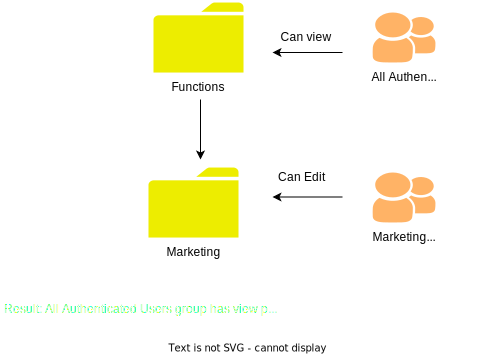

# Hantera behörigheter för mappar {#manage-permissions}

>[!CONTEXTUALHELP]
>id="assets_permissions_folders"
>title="Hantera behörigheter"
>abstract="[!DNL Assets Essentials] tillåter administratörer att hantera åtkomstnivåerna för mappar som är tillgängliga i databasen. Som administratör kan du skapa användargrupper och tilldela behörigheter till dessa grupper för att hantera åtkomstnivåer. Du kan även delegera behörighetshanteringsprivilegier till användargrupper på mappnivå."

I Assets Essentials kan administratörer hantera åtkomstnivåerna för de mappar som är tillgängliga i databasen. Som administratör kan du skapa användargrupper och tilldela behörigheter till dessa grupper för att hantera åtkomstnivåer. Du kan även delegera behörighetshanteringsprivilegier till användargrupper på mappnivå.

I följande dataflödesdiagram visas de åtgärder som du utför för att konfigurera och hantera behörigheter för mappar som är tillgängliga i Assets Essentials-databasen:

## Innan du hanterar behörigheter för mappar {#before-managing-permissions}

Innan du börjar hantera behörigheter för Assets Essentials i din mappdatabas måste du utföra vissa åtgärder, till exempel lägga till administratörer som kan skapa en logisk mappstruktur, skapa användargrupper och hantera mappbehörigheter för olika användargrupper.

### Lägg till administratörer {#add-admin-users}

Lägg till administratörer för programmet Assets Essentials så att de kan hantera mappbehörigheter för andra användargrupper.

Så här lägger du till administratörer:

1. Gå till [Admin Console](https://adminconsole.adobe.com) för din organisation, klicka på **[!UICONTROL Products]** i det övre fältet, klicka på **[!UICONTROL AEM Assets Essentials]** och sedan på [!DNL Assets Essentials]-miljön. [!DNL Assets Essentials] har tre produktprofiler som representerar åtkomst för administratörer, vanliga användare och konsumentanvändare.

   

1. Om du vill lägga till en användare i en grupp klickar du på gruppen Assets Essentials-administratörer, väljer **[!UICONTROL Add User]**, anger användarinformationen och klickar på **[!UICONTROL Save]**.

   

   När du lägger till en användare får användaren en e-postinbjudan om att komma igång. Du kan inaktivera e-postinbjudningar i inställningarna för produktprofilen i [!DNL Admin Console].

1. Om du vill ta bort en användare från en grupp klickar du på gruppen, markerar en befintlig användare och väljer **[!UICONTROL Remove User]**.

### Lägg till användargrupper {#add-user-groups}

Skapa användargrupper och tilldela behörigheter till dessa grupper för att hantera mappåtkomstnivåer i Assets Essentials-databasen. Du kan sedan tilldela dina användare till användargrupperna.

Du kan lägga till användare i användargrupper (1) och [användare i produktprofiler för Assets Essentials (2)](#add-admin-users). Du kan dock inte lägga till användargrupper direkt i Assets Essentials produktprofiler (3).

Mer information om hur du hanterar användargrupper finns i `Create user groups` och `Edit user groups` på [Hantera användargrupper](https://helpx.adobe.com/enterprise/using/user-groups.html).

>[!NOTE]
>
>Om Admin Console är konfigurerat för att utnyttja ett externt system för att hantera användare/grupper-tilldelningar, till exempel Azure- eller Google-anslutningar, användarsynkroniseringsverktyg eller API för användarhanteringsmål, konfigureras dina grupper och användartilldelningar automatiskt. Mer information finns i [Adobe Admin Console-användare](https://helpx.adobe.com/enterprise/using/users.html).

### Lägga till användare i grupper {#add-users-to-uesr-groups}

När du har skapat användargrupper kan du börja lägga till användare i användargrupper.

Mer information om hur du hanterar tillägg av användare i användargrupper finns i `Add users to groups` på [Hantera användargrupper](https://helpx.adobe.com/in/enterprise/using/user-groups.html#add-users-to-groups).

### Skapa mappstruktur {#create-folder-structure}

Du kan använda följande metoder för att skapa en mappstruktur i Assets Essentials databas:

* Klicka på alternativet **[!UICONTROL Create Folder]** i verktygsfältet för att skapa en tom mapp.

* Klicka på alternativet **[!UICONTROL Add Assets]** i verktygsfältet för att [överföra en mappstruktur som är tillgänglig på den lokala datorn](add-delete.md).

Skapa en mappstruktur som fungerar bra med organisationens affärsmål. Om du överför en befintlig mappstruktur till Assets Essentials databas bör du granska strukturen. Mer information finns i [Bästa tillvägagångssätt för effektiv behörighetshantering](permission-management-best-practices.md).

## Hantera behörigheter för mappar {#manage-permissions-on-folders}

Du kan tilldela följande behörigheter till användargrupperna eller användarna. Adobe rekommenderar inte att du tilldelar behörigheter till användare.

| Behörighetsnamn | Beskrivning |
|-----|------|
| Kan visa | <ul><li>Läsbehörighet för att visa och navigera i mappar </li><li>Förhandsgranska resurser</li><li>Hämta resurser</li><li>Kopiera resurser</li><li>Dela länkar till resurser</li><ul> |
| Kan redigera | <ul><li>Alla privilegier som är tillgängliga för Kan visa behörigheter </li><li>Skapa mappar</li><li>Ta bort mappar</li><li>Byt namn på mappar</li><li>Skapa resurser</li><li>Uppdatera resurser</li><li>Ta bort resurser</li><li>Flytta resurser</li><li>Byt namn på resurser</li><ul> |
| Ägare | <ul><li>Alla behörigheter som är tillgängliga för behörigheten Kan redigera</li><li>Hantera behörigheter för en mapp och dess undermappar</li>Med den här behörigheten kan administratörer delegera administratörsbehörighet till andra för en mapp och dess undermappar.<ul> |
| Neka åtkomst | Behörigheterna Ta bort Kan visa, Kan redigera och Ägare för en mapp och dess undermappar. |

**Standardbehörigheter**

Alla användare som är autentiserade och kan logga in på Assets Essentials har `Can Edit` behörigheter till Assets Essentials databas från början. Administratören kan ändra standardbehörigheterna genom att [redigera behörigheter för hela Assets Essentials-databasen](#edit-permissions-entire-repository).

**Sekvens att tilldela mappbehörigheter till användargrupper**

Skapa regler för att tilldela mappbehörigheter till användargrupper. Den sekvens som du använder för att tilldela behörigheter till en mapp är viktig och avgör vilken åtkomst som är tillgänglig för användargrupperna och så småningom användarna.

Om du till exempel tilldelar behörigheterna `Can View` för en mapp till en överordnad grupp och sedan tilldelar `Can Edit` behörigheter till undergruppen, har bara medlemmarna i undergruppen redigeringsbehörigheter för mappen. Supergruppsanvändarna har visningsåtkomst till mappen.

Om du bara behöver ge marknadsföringsavdelningen i din organisation redigeringsbehörighet för mappen `Marketing` och visa behörigheter för andra, tilldelar du `Can View` behörigheter till supergruppen `All Authenticated Users` och `Can Edit` till undergruppen `Marketing`.

**Behörighetsarv**

Assets Essentials använder behörighetsarv, vilket gör att du kan ärva behörighetsuppsättningen för den överordnade mappen i den underordnade mappen. Om den överordnade mappen till exempel har `Can View` behörigheter för gruppen `All Authenticated Users` och den underordnade mappen har `Can Edit` behörigheter för användargruppen `Marketing`, kan alla autentiserade användare ha visningsbehörighet för den underordnade mappen och användargruppen `Marketing` har redigeringsbehörighet för den underordnade mappen. Användargruppen `Marketing` har redigeringsbehörighet för ytterligare mappnivåer under den underordnade mappen (Marketing).

>[!NOTE]
>
> Det går inte att ange `Deny Access`-behörigheter för en grupp på en mapp på en högre nivå och sedan återställa åtkomst (`Can view`, `Can edit` eller `Owner`) för den gruppen eller dess medlem. Använd `Deny Access` sparsamt.

### Lägga till behörigheter i användargrupper {#add-permissions}

Så här tilldelar du gruppbehörigheter till mappar:

1. Markera mappen och klicka på **[!UICONTROL Manage Permissions]**.

1. I dialogrutan **[!UICONTROL Manage Permissions]** anger du namnet på gruppen eller en användare i fältet **[!UICONTROL Groups & Users]**.

1. Välj [åtkomstnivå](#manage-permissions-on-folders) i listrutan **[!UICONTROL Access]**.

1. Klicka på **[!UICONTROL Add]** om du vill ändra behörigheterna för användaren eller användargruppen omedelbart.

1. Upprepa steg 1-3 om du vill lägga till fler regler i dialogrutan **[!UICONTROL Manage Permissions]**.

   

   >[!NOTE]
   >
   > Den ordning som du använder för att tilldela behörigheter till en mapp är viktig och avgör vilken åtkomst som är tillgänglig för användargrupperna och så småningom vilka användare som läggs till i grupperna.

   Om du hanterar behörigheter för flera mappar kan du även välja en annan mapp i den vänstra rutan och börja hantera behörigheter för den mappen.

1. Klicka på **[!UICONTROL Close]**.

>[!CAUTION]
>
> Vi rekommenderar att du hanterar behörigheter för användargrupper och inte för enskilda användare. Det går bara att ange behörigheten `Deny access` för användargrupper, men inte för enskilda användare.

### Redigera behörigheter som tilldelats användargrupper {#edit-permissions}

Så här redigerar du behörigheter som tilldelats användargrupper i mappar:

1. Markera mappen och klicka på **[!UICONTROL Manage Permissions]**.

1. Redigera [åtkomstnivån](#manage-permissions-on-folders) i listrutan **[!UICONTROL Access]** i dialogrutan **[!UICONTROL Manage Permissions]**.

1. [Lägg till fler användargrupper eller användare](#add-permissions) i de befintliga behörighetsreglerna, om det behövs.

1. Klicka på X om du vill ta bort de behörigheter som tilldelats en användargrupp.

### Redigera behörigheter för hela Assets Essentials-databasen {#edit-permissions-entire-repository}

En programadministratör kan redigera behörigheter för hela Assets Essentials-databasen från en standardåtkomstnivå `Can Edit` till vilken annan åtkomstnivå som helst.

Så här redigerar du behörigheter för hela Assets Essentials-databasen:

1. Markera en mapp och klicka på **[!UICONTROL Manage Permissions]**.

1. Klicka på **[!UICONTROL All Assets]** i den vänstra listen i dialogrutan **[!UICONTROL Manage Permissions]**.

1. [Redigera behörigheterna](#edit-permissions) och stäng dialogrutan.

>[!NOTE]
>
>En administratör kan inte välja behörighetsnivån `Deny Access` för hela Assets Essentials-databasen för att se till att användare åtminstone har läsåtkomst till programmet. På samma sätt har `All Authenticated Users` minst läsbehörighet till databasen, även om administratören uttryckligen tar bort `Can Edit`-behörigheterna i dialogrutan [!UICONTROL Manage Permissions].

## Exempel på effektiv behörighetshantering {#example-permission-management}

**Använd skiftläge**

* Alla gruppen Autentiserade användare har visningsåtkomst till databasen.
* Teamspecifika användargrupper har redigeringsbehörigheter i sin egen funktionsspecifika mapp.
* Juridisk mapp är inte tillgänglig för visning av någon autentiserad användare förutom det juridiska teamet.

Skapa följande användargrupper i Admin Console:

* Marknadsföringsteam

* Grupp för varumärkesgodkännare

* Projektledare

* Project X-teamet

* Jurister

I följande diagram visas mapphierarkin och de behörigheter som tilldelats respektive användargrupp:

Följande åtkomstnivåer gäller för alla användargrupper i mapphierarkin:

* /Alla Assets: Administratören ändrar behörigheterna på rotnivå från standardvärdet `Can Edit` till `Can View`. Alla användare kan visa mappar och resurser, men de kan inte redigera dem.

* /marketing: Alla användare kan visa mapparna och undermapparna baserat på behörighetsarv, men användargruppen för Marketing Team har redigeringsbehörigheter för mappen.

* /brand: Alla användare kan visa mapparna och undermapparna baserat på behörighetsarv, men gruppen för godkännande av varumärken har redigeringsbehörigheter för mappen.

* /projects: Alla användare kan visa mapparna och undermapparna baserat på behörighetsarv. Användargruppen Projektledare har:

   * Redigera behörigheter

   * Ägarbehörigheter: Hantera behörigheter för en mapp och dess undermappar.

* /projects/project-x: Alla användare kan visa mapparna och dess undermappar. Användargruppen Projektledare i teamet har redigeringsbehörigheter och kan hantera behörigheter för en mapp och dess undermappar (ägarbehörigheter). Användargruppen Project X Team har redigeringsbehörighet.

* /legal: Ingen av användarna har åtkomst till mappen baserat på behörigheterna `Deny Access` för gruppen `All Authenticated Users`. Användargruppen Legal Team har redigeringsbehörighet.

## Nästa steg {#next-steps}

* [Titta på en video om hur du hanterar behörigheter i Assets Essentials](https://experienceleague.adobe.com/docs/experience-manager-learn/assets-essentials/configuring/permissions-management.html)

* Ge feedback om dokumentationen med [!UICONTROL Edit this page]  eller [!UICONTROL Log an issue]  som är tillgängligt på den högra sidopanelen

* Kontakta [kundtjänst](https://experienceleague.adobe.com/?support-solution=General#support)
