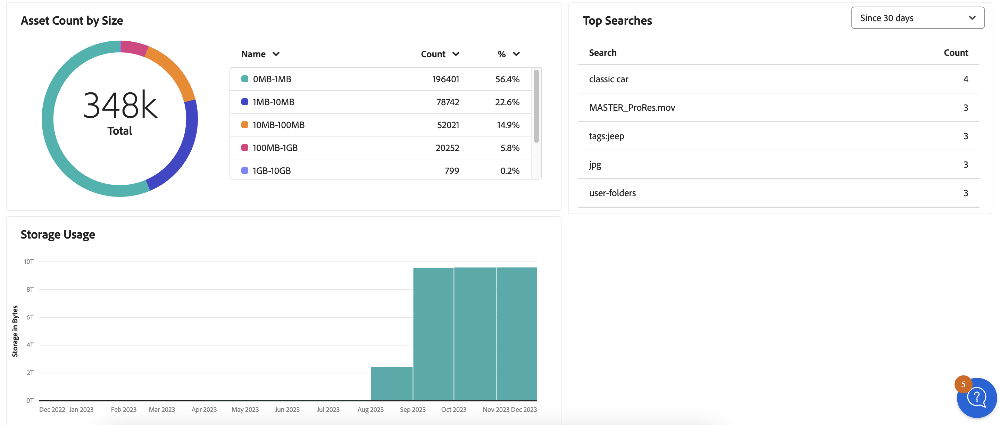

# Hantera rapporter {#manage-reports}

Resursrapportering ger administratörer insyn i Adobe Experience Manager Assets Essentials-miljöns aktivitet. Dessa data ger användbar information om hur användarna interagerar med innehållet och produkten. Alla användare har tillgång till Insikter-kontrollpanelen och de som har tilldelats administratörens produktprofil kan skapa användardefinierade rapporter.

## Åtkomstrapporter {#access-reports}

Alla användare som är tilldelade till produktprofilen [Assets Essentials Administrators](deploy-administer.md) har åtkomst till Insikter-instrumentpanelen eller kan skapa användardefinierade rapporter i Assets Essentials.

Navigera till **[!UICONTROL Reports]** under **[!UICONTROL Settings]** för att få åtkomst till rapporter.

<!--
In the **[!UICONTROL Reports]** screen, various components are shown in the tabular format which includes the following:

* **Title**: Title of the report
* **Type**: Determines whether the report is uploaded or downloaded to the repository
* **Description**: Provide details of the report that was given during uploading/downloading the report
* **Status**: Determines whether the report is completed, under progress, or deleted.
* **Author**: Provides email of the author who has uploaded/downloaded the report.
* **Created**: Gives information of the date when the report was generated.
-->

## Skapa en rapport {#create-report}

I AEM Assets Essentials-miljön finns omfattande rapporteringsfunktioner via rapportpanelen. Med den här funktionen kan användarna generera och ladda ned CSV-rapporter med information om överföringar och hämtningar av resurser inom angivna tidsramar, från en gång till en gång per dag, varje vecka, varje månad eller varje år.

**Så här skapar du en rapport:**

1. Navigera till **Rapporter** och klicka på **Skapa rapport** (längst upp till höger). I dialogrutan **Skapa rapport** visas följande fält:
   

   **På fliken Konfiguration:**

   1. **Rapporttyp:** Välj bland rapporttyperna [!UICONTROL Upload] eller [!UICONTROL Download].
   1. **Titel:** Lägg till en titel i rapporten.
   1. **Beskrivning:** Lägg till en valfri beskrivning i rapporten.
   1. **Välj mappsökväg:** Välj en mappsökväg för att generera rapporten med överförda och hämtade resurser i den specifika mappen. Om du till exempel behöver rapporten med resurser som överförts till en mapp anger du sökvägen till den mappen.
   1. **Välj datumintervall:** Välj datumintervall för att visa överförings- eller hämtningsaktiviteten i mappen.
    

   >[!NOTE]
   >
   > Assets Essentials konverterar alla lokala tidszoner till UTC (Coordinated Universal Time).

   **På fliken Kolumner:** Markera kolumnnamnen som ska visas i rapporten. I följande tabell förklaras hur du använder alla kolumner:

   <table>
    <tbody>
     <tr>
      <th><strong>Kolumnnamn</strong></th>
      <th><strong>Beskrivning</strong></th>
      <th><strong>Typ av rapportering</strong></th>
     </tr>
     <tr>
      <td>Titel</td>
      <td>Namnet på resursen.</td>
      <td>Överför och hämta</td>
     </tr>
     <tr>
      <td>Bana</td>
      <td>Mappsökvägen där resursen är tillgänglig i Assets Essentials.</td>
      <td>Överför och hämta</td>
     </tr>
     <tr>
      <td>MIME-typ</td>
      <td>MIME-typen för resursen.</td>
      <td>Överför och hämta</td>
     </tr>
     <tr>
      <td>Storlek</td>
      <td>Resursens storlek i byte.</td>
      <td>Överför och hämta</td>
     </tr>
     <tr>
      <td>Hämtat av</td>
      <td>E-post-ID för den användare som hämtade resursen.</td>
      <td>Ladda ned</td>
     </tr>
     <tr>
      <td>Hämtningsdatum</td>
      <td>Datumet då hämtningsåtgärden för resursen utförs.</td>
      <td>Ladda ned</td>
     </tr>
     <tr>
      <td>Författare</td>
      <td>Resursens författare.</td>
      <td>Överför och hämta</td>
     </tr>
     <tr>
      <td>Skapad den</td>
      <td>Det datum då tillgången överförs till Assets Essentials.</td>
      <td>Överför och hämta</td>
     </tr>
     <tr>
      <td>Ändringsdatum</td>
      <td>Datumet då tillgången senast ändrades.</td>
      <td>Överför och hämta</td>
     </tr>
     <tr>
      <td>Utgånget</td>
      <td>Tillgångens förfallostatus.</td>
      <td>Överför och hämta</td>
     </tr>
     <tr>
      <td>Hämtat efter användarnamn</td>
      <td>Namnet på den användare som hämtade resursen.</td>
      <td>Ladda ned</td>
     </tr>              
    </tbody>
   </table>

## Visa och hämta befintlig rapport {#View-and-download-existing-report}

Befintliga rapporter visas på fliken **Utförda rapporter**. Klicka på **Rapporter** och välj **Utförda rapporter** om du vill visa alla skapade rapporter med statusen **Slutförd**, vilket anger att de är klara för hämtning. Om du vill hämta rapporten i CSV-format eller ta bort rapporten markerar du rapportraden och väljer **Hämta CSV** eller **Ta bort**.

## Schemalägg en rapport {#schedule-report}

I gränssnittet AEM Grundläggande anger **Schemalägg rapport** en automatisk generering av rapporter med angivna framtida intervall, till exempel varje dag, vecka, månad eller år. Den här funktionen hjälper till att effektivisera återkommande rapporteringsbehov och säkerställer att det finns aktuella datauppdateringar. När **Skapa rapport** genererar rapporter för tidigare datum. Slutförda rapporter listas under **Utförda rapporter** och kommande rapporter finns under **Schemalagda rapporter**.

Följ stegen nedan för att schemalägga en rapport:

1. Klicka på Rapporter i den vänstra rutan och sedan på Skapa rapport (uppifrån till höger).
1. I rapportdialogrutan visas följande information:
   1. **Typ av rapportering:** Välj mellan överförings- och hämtningstyp.
   1. **Titel:** Lägg till en titel i rapporten.
   1. **Beskrivning**: Lägg till en valfri beskrivning till rapporten.
   1. **Välj mappsökväg:** Välj en mappsökväg för att generera en rapport för resurser som ska överföras till eller hämtas från den aktuella mappen i framtiden.
   1. Växla **Schemarapport:** Växla för att schemalägga rapporten senare eller för dess upprepade förekomst.
      

   1. **Välj frekvens:** Ange intervallet för att generera rapporten (till exempel dagligen, veckovis, månadsvis, årsvis eller en gång) och ange datum och tid för att köra rapporten tillsammans med slutdatumet för upprepning. För en engångsrapport väljer du datumintervallet för rapporten om den valda aktivitetstypen i AEM. Om du till exempel behöver en rapport om hämtade resurser från den 10 till den 29 (framtida datum) för en viss månad, väljer du dessa datum i fältet **Välj datumintervall**.

   >[!NOTE]
   >
   > Assets Essentials konverterar alla lokala tidszoner till UTC (Coordinated Universal Time).

## Visa schemalagda rapporter {#view-scheduled-reports}

Schemalagda rapporter visas på fliken **Schemalagda rapporter** på ett systematiskt organiserat sätt. Alla slutförda rapporter för varje schemalagd rapport lagras i en enda rapportmapp. Klicka på  för att visa de slutförda rapporterna. Om du till exempel har schemalagt en daglig rapport grupperas alla slutförda rapporter tillsammans i en mapp. Den här organisationen förenklar både navigering och identifiering av rapporter. Om du vill visa schemalagda rapporter klickar du på **Rapporter** och sedan på **Schemalagda rapporter**. Alla schemalagda rapporter visas med status pågående eller slutförd. Slutförda rapporter kan hämtas.

## Redigera och avbryta schemalagda rapporter {#edit-cancel-scheduled-reports}

1. Gå till fliken **Schemalagda rapporter**.
1. Markera rapportraden.
1. Klicka på **Redigera**.
1. Klicka på **Avbryt schema** och sedan på **Bekräfta** för att avbryta den schemalagda rapporten. För avbrutna rapporter blir nästa körningstid tom och statusen avbryts.
   

### Återuppta schema {#resume-schedule}

Om du vill återuppta det avbrutna schemat markerar du rapportraden och klickar på **Återuppta schema**. När det återupptas visas nästa körningspost igen och statusen visas löpande.

>[!NOTE]
>
> Om du återupptar en avbruten rapport före det schemalagda slutdatumet genereras automatiskt rapporter från avbrottsdatumet till återköpsdatumet.

## Visa insikter {#view-live-statistics}

>[!CONTEXTUALHELP]
>id="assets_reports"
>title="Rapporter"
>abstract="På Insikter-kontrollpanelen kan du visa händelsemått i realtid för din Experience Manager Assets-miljö under de senaste 30 dagarna eller under de senaste 12 månaderna. Listan med händelser innehåller antalet nedladdningar, uppladdningar, de vanligaste sökningarna osv."

Med Assets Essentials kan du visa realtidsdata för din Assets Essentials-miljö med Insikter-instrumentpanelen. Du kan visa händelsemått i realtid under de senaste 30 dagarna eller under de senaste 12 månaderna.

<!---->

Klicka på **[!UICONTROL Insights]** i den vänstra navigeringsrutan för att visa följande automatiskt genererade diagram:

* **Hämtningar**: Antalet resurser som hämtats från Assets Essentials-miljön under de senaste 30 dagarna eller 12 månaderna representeras av ett linjediagram.
  

* **Överföringar**: Antalet resurser som har överförts till Assets Essentials-miljön under de senaste 30 dagarna eller 12 månaderna visas i ett linjediagram.
  

<!--* **Asset Count by Size**: The division of count of assets based on their range of various sizes from 0 MB to 100 GB.-->

* **Lagringsanvändning**: Lagringsanvändningen (i byte) för Assets Essentials-miljön som representeras av ett stapeldiagram.
  
  <!--* **Delivery**: The graph depicts the count of assets as the delivery dates.-->

<!--* **Asset Count by Asset Type**: Represents count of various MIME types of the available assets. For example, application/zip, image/png, video/mp4, application/postscripte.-->

* **Vanliga sökningar**: Visa de mest sökta söktermerna tillsammans med det antal gånger som de sökts igenom i din Assets Essentials-miljö under de senaste 30 dagarna eller 12 månaderna i tabellformat.
  

  <!--
   
   
   -->

* **Antal tillgångar efter storlek:** Segmenterar det totala antalet tillgångar i Assets Essentials-miljön i olika storleksintervall, vilket markerar antalet och procentandelen resurser i varje storleksintervall, som representeras av ett bottendiagram.
  

* **Antal tillgångar per tillgångstyp:** Segmenterar det totala antalet tillgångar i Assets-miljön, vilket markerar antalet och procentandelen resurser baserat på deras filtyper, som representeras av ett bottendiagram.
  

