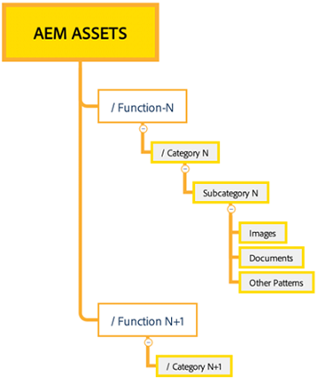
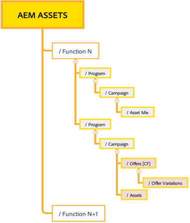

# Effektiv behörighetshantering {#best-practices-permissions-management}

Innan du börjar hantera mappbehörigheterna för Assets Essentials-databasen som administratör finns det olika metodtips som du kan implementera för att göra infrastrukturen intuitiv för administratörer och slutanvändare senare när du hanterar åtgärder.

Du kan använda dessa bästa metoder samtidigt som:

* [Skapa användargrupper i Admin Console](#admin-console-best-practices)

* [Skapa mappstruktur i Assets Essentials-databasen](#folder-structure-assets-essentials)

* [Hantera behörigheter i Assets Essentials-databasen](#folder-permissions)

## Admin Console {#admin-console-best-practices}

Identifiera åtkomstbehov baserat på användargrupper i organisationen. Planera och skapa användargrupper för din organisation och lägg till användare i de användargrupperna. Det är enklare att hantera mappbehörigheter baserat på användargrupper och inte enskilda användare.

## Mappstruktur för Assets Essentials-databas {#folder-structure-assets-essentials}

Tänk på följande när du börjar planera för att skapa en mappstruktur i Assets Essentials-databasen:

* Framtida styrning: Mapparna som styrs av administratörer och mapparna som har [delegerats för behörighet till andra användare som ägare](manage-permissions.md##manage-permissions-folders).

* Skalbar: Mappstrukturen bör vara anpassad efter organisationens framtida behov och bör vara enkel att skala.

* Storlek: En mapp får inte innehålla för många resurser. Det kan leda till användbarhetsproblem och kan bli svårt att hantera.

* Intuitiv: Mappstrukturen bör vara enkel att bläddra i och intuitiv för slutanvändarna. Användare bör enkelt kunna identifiera var en ny resurs ska överföras i mappstrukturen.

Det finns olika mappstrukturtyper som du kan använda för din organisation. Nedan följer några exempel på typiska mappstrukturer:

* Funktion och kategorisering

  

* Kampanjbaserad

  

* Platsbaserad (eller kanalbaserad)

  

## Mappbehörigheter {#folder-permissions}

När du har skapat användargrupper för din organisation, lagt till användare i de användargrupperna och valt och skapat en mappstruktur i Assets Essentials databas som passar din organisations behov, kan du börja hantera mappbehörigheter för din organisation. Tänk på följande när du börjar hantera mappbehörigheter:

* Använd behörigheter för användargrupper, inte för enskilda användare. Detta resulterar i en enklare och effektivare behörighetsstruktur.

* Behåll behörighetsstrukturen så enkel som möjligt för att effektivisera driften.

* Använd behörigheten Neka noggrant och använd istället positiv behörighet (Kan redigera, Kan visa, Ägare) för mappstrukturen.

Exempel på hur du får en effektiv och enkel mappstruktur finns i [Hantera behörigheter för mappar](manage-permissions.md##manage-permissions-folders).

## Nästa steg {#next-steps}

* Ge produktfeedback med alternativet [!UICONTROL Feedback] som finns i användargränssnittet för Assets Essentials

* Ge feedback om dokumentationen med [!UICONTROL Edit this page]  eller [!UICONTROL Log an issue]  som är tillgängligt på den högra sidopanelen

* Kontakta [kundtjänst](https://experienceleague.adobe.com/sv?support-solution=General#support)
