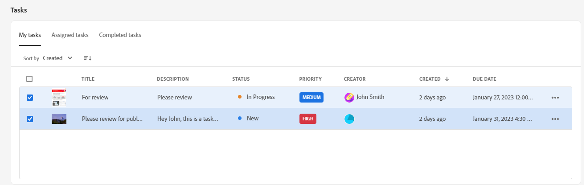
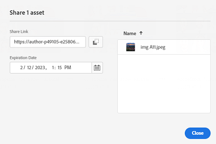

# Versionsinformation om [!DNL Assets Essentials] {#release-notes}

Den nuvarande releasen av Assets Essentials släpptes den 18 april 2024.

Några av de nyligen tillagda funktionerna:

**Sammanhangsbaserad sökning**

Du kan nu även söka efter resurser som är tillgängliga i databasen genom att definiera textmeddelanden. Experience Manager Assets omvandlar automatiskt dessa textmeddelanden till sökfilter och visar sökresultaten. Du kan visa och ändra automatiska filter med hjälp av filterpanelen för att begränsa sökresultaten ytterligare.

<!--

**Dynamic renditions**

You can now view and download dynamic renditions (including smart crops) in Experience Manager Assets. Dynamic renditions are customized versions of image assets created in real-time to meet specific needs, such as resizing images based on device resolution or cropping to fit different aspect ratios. These renditions enable organizations to deliver personalized and optimized experiences to diverse audience needs.

-->

**Byt namn på plats för resurser och mappar**

Experience Manager Assets erbjuder nu en förenklad användarupplevelse genom att ge möjlighet att byta namn på en resurs eller en mapp med ett enda klick.

**Snabbåtgärder för Express-video**

Experience Manager Assets har nu lättanvända och intuitiva videoredigeringsverktyg som bygger på Adobe Express för att öka återanvändningen av innehåll och snabba upp hastigheten. Redigeringsalternativen omfattar trimning, beskärning, storleksändring av en video och även konvertering av en MP4-fil till en GIF-fil.

>[!NOTE]
> Tillstånd att få åtkomst till [!DNL Adobe Express] krävs och minst en miljö i AEM Assets. Miljön kan vara någon av databaserna i [!DNL Assets as a Cloud Service] eller [!DNL Assets Essentials].

**Tilldela eller ta bort metadataformulär till flera mappar**

Ett metadataformulär kan nu tilldelas eller tas bort från flera mappar.

**Hantera behörigheter för privata samlingar**

Du kan tillåta administratörer och icke-administratörer (andra användare) att hantera åtkomstnivåer för privata samlingar som är tillgängliga i databasen. Du kan tilldela användargrupperna eller användarna behörigheter som `Can View` och `Can Edit`. Du kan även delegera behörighetshanteringsbehörigheter till användargrupper.

**Förbättringar baserade på kundfeedback**

Förbättringar och felkorrigeringar som bygger på kundfeedback.

## Kända fel {#known-issues}

Listan över kända problem med erbjudandet [!DNL Assets Essentials] revideras och uppdateras fortlöpande.

<!--

* Assets Essentials does not support creating Private collections.

-->

<!--* Private collections are available to creator and the users with administrator privileges. As an administrator, you cannot delegate the permissions to access the collection to other users.-->

Om du stöter på problem eller till och med förbättringsförfrågningar [kan du ge teamet feedback](#provide-feedback).

## Tidigare versioner {#past-releases}

### Januariversion 2024 {#january-2024-release}

**Smarta taggar blocklist**

Med Assets Essentials kan du nu definiera blockeringslista som innehåller ord som inte ska läggas till som smarta taggar för resurser när de överförs till databasen. Med den här funktionen kan ni upprätthålla varumärkets efterlevnad och minska arbetet med att moderera smarta taggar.

**Skapa GenAI-bilder med Adobe Firefly**

Skapa nya bilder baserat på sökfrågor med en integrerad Adobe Firefly text-till-bild-funktion (kräver licens för Adobe Firefly).

**Sök efter liknande bilder**

Nu kan du enkelt hitta innehåll genom att välja en bild och visa liknande bilder i Experience Manager Assets-databasen.

**Redigerare för inbäddad Adobe Express i AEM Assets**

Användare med tillgång till Express har nu integrerade verktyg för bildredigering och bildskapande, från Adobe Express och Adobe Firefly, tillgängliga direkt inifrån AEM Assets, för att förbättra återanvändningen av innehåll och snabba upp hastigheten på innehållet.

**Rapporter om lagringsanvändning i insikter**:

Administratörer kan nu visa användningsrapporter för lagring som ingår i Insights.

**Sök i den första konfigurationen för hemsidan**

Nu kan du konfigurera startsidan för din organisation med Assets Essentials. Om du väljer att söka först som startsida kan du konfigurera sökfältets justering, bakgrundsbild och logotyp för din organisation. Om du väljer [!UICONTROL General Settings] åsidosätts standardstartsidan. Standardlandningen är till exempel [!UICONTROL My Workspace] för administratörer och [!UICONTROL Search First] för icke-administratörer. Om du väljer något av alternativen under Allmänna inställningar gäller detta för alla användare

### Oktober 2023-versionen {#october2023-release}

**Massimportera resurser från OneDrive-datakällan**

Administratörer kan nu [importera ett stort antal resurser från OneDrive till AEM Assets](/help/using/bulk-import-assets-view.md). Den uppdaterade listan över datakällor som stöds för bulkimport innehåller Azure, AWS, Google Cloud, Dropbox och OneDrive.

**Stöd för berättiganden mellan organisationer för bibliotek**

Nu kan du konfigurera åtkomst till Creative Cloud-bibliotek i en annan IMS-organisation med Experience Manager Assets. Det ger enklare åtkomst till de senaste produktövergripande arbetsflödena mellan Creative Cloud och Experience Manager och minskar tiden och arbetet för kreatörerna.

### September 2023-utgåvan {#september2023-release}

**Tilldela metadataformulär till en mapp**

Nu kan du tilldela metadataformulär till en viss mapp i din Assets Essentials-distribution. Alla resurser i mappen, inklusive resurser i undermapparna, visar sedan egenskaper som definierats i det tilldelade metadataformuläret.

**Massimportera resurser från datakällor**

Administratörer kan nu importera ett stort antal resurser från en datakälla till AEM Assets. Administratörerna behöver inte längre överföra enskilda resurser eller mappar till AEM Assets. De datakällor som stöds för bulkimport är bland annat Azure, AWS, Google Cloud och Dropbox.

**Bildredigeringsverktyg som bygger på Adobe Express**

De enkla och intuitiva bildredigeringsverktygen som bygger på Adobe Express är tillgängliga direkt i AEM Assets för att öka återanvändningen av innehåll och snabba upp hastigheten.

**Flexibilitet vid fästning av objekt för Min Workspace Quick Access**

Möjlighet att markera och fästa objekt åt dig, för hela organisationen eller för en lista med grupper så att de visas i snabbåtkomstavsnittet i Min Workspace utifrån ditt val.

### juliversion 2023 {#july2023-release}

**Förbättrat ramverk för artificiell intelligens för smarta bildtaggar**

Experience Manager Assets använder nu ett förbättrat ramverk för artificiell intelligens för smarta taggar i bilder. Den här innehållsintelligensen ger bättre relevans och precision för smarta taggar som är tillgängliga för alla bildresurser vid förtäring.

**Konfigurera visning av kolumner för Assets listvy**

Assets Essentials kan nu välja vilka kolumner som ska visas i listvyn i Assets, t.ex. Status, Format, Dimensioner, Storlek och så vidare.

**Sortera sökresultat baserat på relevans**

Assets Essentials sorterar nu sökresultaten baserat på relevans som standard. Du kan sortera de sökda resurserna i stigande eller fallande ordning `Name`, `Relevance`, `Size`, `Modified` och `Created`.

### Juniversion 2023 {#june2023-release}

**Hierarkisk taggning av resurser för snabbare sökupplevelse**

Platta listor med kontrollerade vokabulärer blir ohanterliga över tid. Assets Essentials har nu stöd för hierarkisk taggningsstruktur, som gör det enklare att använda relevanta metadata, kategorisera resurser, söka, återanvända taggar, förbättra upptäckbarheten och så vidare.

**Fäst filer, mappar och samlingar för snabb åtkomst**

Du kan nu fästa filer, mappar och samlingar så att du snabbare kommer åt dessa objekt när du behöver dem senare. De fästa objekten visas i avsnittet **Snabbåtkomst** i Min Workspace. Du kan komma åt dem med Mitt Workspace i stället för att navigera till den plats där de sparas i databasen.

**Filtrera resurser i papperskorgen**

Med Assets Essentials kan du nu filtrera resurser som finns i papperskorgen. Du kan använda standardfilter eller anpassade filter för att söka efter lämpliga resurser i papperskorgen för att antingen återställa eller ta bort dem permanent.

**Miniatyrförhandsvisningar för 3D-resurser**

Assets Essentials genererar nu miniatyrbilder för vanliga 3D-filformat som gLB, USDz, FBX, 3DS, OBJ och SBSAR. När dessa filer överförs till Assets Essentials skapas miniatyrbilder automatiskt av systemet som standard.

**Visa de mest sökta termerna**

Assets Essentials har nu stöd för att visa de vanligaste söktermerna i din Assets Essentials-distribution med **Insights** -avsnittet i Min Workspace. Du kan även navigera till detaljerade insikter för att visa de vanligaste sökningarna under de senaste 30 dagarna eller 12 månaderna.

**Förbättringar av metadataformulär**

Med Assets Essentials kan du nu lägga till text med flera värden och nedrullningsbara listegenskapskomponenter i metadataformulären.

### Flera versioner under 2023 {#multiple-releases-2023}

Listan över nyligen tillagda funktioner innehåller:

**Populärast hämtade resurser**

Min Workspace visar nu de tio mest hämtade resurserna för din Assets Essentials-miljö i avsnittet [!UICONTROL Content]. Du kan också visa formattyp och antal hämtningar för varje listad resurs.

**Massuppdateringar av metadata för resurser**

Med hjälp av satsvisa metadatauppdateringar kan du utföra vanliga metadatauppdateringar för flera resurser samtidigt. Du behöver inte uppdatera posterna individuellt och kan snabbt tillämpa egenskaper på resurser och mappar som du kommer åt via sökningen. Dessutom skrivs alla befintliga värden över vid uppdatering av massmetadata, vilket innebär att befintliga nyckelord skrivs över av uppdateringen av massmetadata.

**Min Workspace med konfigurerbara widgetar**

Assets har nu en skräddarsydd arbetsyta som fungerar som en totallösning för att ge smidig åtkomst till viktiga delar av Assets användargränssnitt och information som är relevant för dig. Snabbare åtkomst till dessa alternativ ökar materialets hastighet och effektivitet.

Min Workspace innehåller widgetar för insikter, uppgifter och innehåll. Du kan konfigurera hur dessa widgetar visas i din Workspace utifrån dina inställningar.

**Dedikerat gränssnitt för uppgiftshantering**

Med Assets Essentials kan du nu hantera listan över uppgifter som för närvarande är tilldelade dig, skapade av dig och redan har slutförts av dig på en central plats med det nya **[!UICONTROL Tasks]**-alternativet som finns i det vänstra navigeringsfönstret. Du kan också vidta lämpliga åtgärder genom att välja en uppgift som ska godkännas eller avvisas, eller öppna uppgiftsinformationen för att godkänna, avvisa, redigera eller ta bort den.

**Autogenererade länkar för att dela resurser**

Assets Essentials skapar nu en länk automatiskt så snart du väljer att dela en resurs med användargränssnittet i Assets Essentials. Den genererade länken fortsätter att gälla även om du ändrar förfallodatumet.

**Förbättringar baserade på kundfeedback**

Förbättringar och felkorrigeringar som bygger på kundfeedback.

### 2022.11.0 {#november-2022}

Novemberversionen av [!DNL Assets Essentials] släpps den 17 november 2022.

Den här versionen innehåller:

**Förhandsgranska dokument med Document Cloud Viewer**

I Assets Essentials kan du nu överföra dokument i andra format som stöds och förhandsgranska dem med det medföljande visningsprogrammet för Document Cloud. De format som stöds är TXT, RTF, DOC, DOCX, PPT, PPTX, XLS och XLSX.

<!--

**View Smart Tags moderation reports**

Asset reporting now provides administrators with visibility into the Smart Tags promoted or deleted for an asset. You can specify a folder path and the report lists the Smart Tags promoted or deleted for all assets available at the folder path.

-->

<!--
**Read-only access to large number of users**

Assets Essentials allows administrators to provide read-only access to a large number of users for selected assets or folders in the repository. 
You can easily synchronize the user groups available on the external identity management of an organization with Adobe Admin Console and then manage permissions in Admin Console and Assets Essentials to provide the users with read-only access for selected assets or folders.

-->

**Nytt alternativ för att spara metadata**

Ett nytt Spara metadata-alternativ finns nu i användargränssnittet i Assets Essentials för bättre metadatastyrning.

**Förbättringar baserade på kundfeedback**

Förbättringar och felkorrigeringar som bygger på kundfeedback.

**Adobe Asset Link version 3.3**

[Adobe Asset Link](https://helpx.adobe.com/enterprise/using/adobe-asset-link.html) version 3.3 släpptes 13 december 2022 med följande funktioner:

* Stöd för [Creative Cloud för team](https://www.adobe.com/creativecloud/business/teams.html) förutom stöd för [Creative Cloud för företag](https://www.adobe.com/creativecloud/business/enterprise.html) tidigare.

* Stöd för de senaste Adobe InDesign-, Photoshop- och Illustrator 2023-programmen.

* Stöd för CEP-plugin för Adobe Asset Link i miljöer med proxyservrar.

### 2022.8.0 {#august-2022}

Augustiversionen av [!DNL Assets Essentials] släpps den 22 augusti 2022.

Den här versionen innehåller:

**Meddelanden för samlingar**

Med Assets Essentials-meddelanden kan du nu övervaka de åtgärder som utförs på de samlingar som är tillgängliga i databasen. Du måste välja och prenumerera på de samlingar som du får meddelanden om. Du kan också konfigurera åtgärder som meddelanden skickas för, till exempel borttagning, delning av länk, flytt, namnbyte och uppdatering av samlingar.

**Redigera smarta samlingar**

Assets Essentials kan nu även redigera de sökvillkor som används när en smart samling skapas.  Spara de nya sökvillkoren för att uppdatera samlingens innehåll dynamiskt.

**Visa Live-statistik för lagringskonto**

Med Assets Essentials kan du nu även visa kontodata i realtid för din Assets Essentials-miljö med kontrollpanelen Live-statistik. Du kan visa händelsemått i realtid de senaste 30 dagarna eller de senaste 12 månaderna.

**Visa överföringsrapporter**

Resursrapporteringen ger nu administratörer insyn i resurser som överförts till Adobe Experience Manager Assets Essentials-distributionen. Administratörer har redan möjlighet att skapa rapporter för de resurser som hämtas från distributionen av Assets Essentials. Dessa data ger användbar information om hur användarna interagerar med innehållet och produkten.

**Förbättringar baserade på kundfeedback**

Förbättringar och felkorrigeringar som bygger på kundfeedback.

### 2022.6.0 {#june-2022}

Juniversionen av [!DNL Assets Essentials] släpps den 14 juli 2022.

Den här versionen innehåller:

**Smarta samlingar**

Spara sökresultaten som en smart samling för att dynamiskt uppdatera samlingens innehåll. Om det finns resurser som har lagts till i Assets Essentials-databasen som uppfyller sökvillkoren som angavs när [den smarta samlingen](manage-collections.md#create-smart-collection) skapades, uppdateras innehållet i den smarta samlingen automatiskt.

**Meddelanden**

Med Assets Essentials-meddelanden kan du [övervaka åtgärder som utförs på resurser och mappar som är tillgängliga i databasen](manage-notifications.md). Du måste välja och prenumerera på det innehåll som meddelandena skickas till dig för. Du kan också konfigurera de kategorier som meddelanden skickas till dig för.

**Rapportering**

Med tillgångsrapportering kan administratörer utvärdera användaraktiviteten i Adobe Experience Manager Assets Essentials. Rapporterna och kontrollpanelen för live-statistik innehåller användbar information om hur användare interagerar med resurser som är tillgängliga i din distribution. [Använd informationen i rapporterna](manage-reports.md) för att få fram nyckeltal för att mäta användningen av Assets i ditt företag och av dina kunder.

Visa tillgångshämtningsrapporter och instrumentpanelsmodulen för livstatistik för att se vilka resurser som hämtas och hur ofta hämtningarna görs.

### 2022.5.0 {#may-2022}

Maj-utgåvan av [!DNL Assets Essentials] släpptes 16 juni 2022.

Den här versionen innehåller:

**Förbättringar av resursstatus**

* Med Assets Essentials kan du nu [ange ett förfallodatum för en resurs](manage-organize.md#set-asset-status). Dessutom kan du [filtrera resurser](search.md#refine-search-results) baserat på resursstatus `Expired` och ett förfallodatumintervall.

* Nu kan du visa statusindikatorn för alla resurser som är tillgängliga i Papperskorgen. Därför kan du välja att återställa en resurs baserat på dess status.

**Förbättringar av sökfilter**

* Med Assets Essentials kan du nu [filtrera resurser](search.md#refine-search-results) med resursstatusen `No Status`.

<!--

* Assets Essentials now supports [using a wildcard operator (*) while using custom filters](search.md#custom-filters) to enable Assets Essentials to display assets in the results that partially match the search criteria.

-->

**Förbättringar av samlingar**

<!--

* Assets Essentials now enables you to [create Private collections](manage-collections.md#create-collection).

-->

* Assets Essentials har nu stöd för [hämtning av en samling](manage-collections.md).

* Nu kan du redigera metadatafältet Beskrivning för en samling.

**Dokumentationsförbättringar**

* En ny version av översiktsdokumentationen för [Assets Essentials ](introduction.md) finns nu tillgänglig.

**Förbättringar baserade på kundfeedback**

* Förbättringar och felkorrigeringar som bygger på kundfeedback.

### 2022.4.0 {#april-2022}

Den aktuella versionen av [!DNL Assets Essentials] släpptes 12 maj 2022. Den här versionen innehåller:

* [!DNL Assets Essentials] har nu stöd för [att skapa samlingar](manage-collections.md). En samling är en uppsättning resurser i Experience Manager Assets Essentials. Använd samlingar för att dela resurser mellan användare. Till skillnad från mappar kan en samling innehålla resurser från olika platser.

* Med Assets Essentials kan du nu även [lägga till anpassade filter](search.md#custom-filters) i användargränssnittet. Du kan sedan använda dessa anpassade filter utöver standardfiltren för att förfina sökresultaten.

* Assets Essentials kan nu [ange status](manage-organize.md#set-asset-status) för resurser som är tillgängliga i databasen. Ange en resursstatus som bättre styr och hanterar nedströmsanvändningen av digitala resurser.

* Förbättringar och felkorrigeringar som bygger på kundfeedback.

#### Inkognitoläge i Chrome {#incognito-mode}

I den här versionen optimerar vi prestanda för gränssnittsleverans och specifika funktioner i Assets Essentials - som kommenterar resurser och bildredigering - beroende på att webblagring och cookies från tredje part är aktiverade. Inkognitionsläget i Chrome webbläsare blockerar cookies från tredje part som standard - användare har ett antal alternativ för att fortsätta få tillgång till alla funktioner:

* Använd Chrome-profiler i stället för Incognito-läget när användaren behöver separata webbläsarsessioner

* Stäng av `Block third-party cookies` på skärmen för läget Inkognito i Chrome

### 2022.2.0 {#march-2022}

[!DNL Assets Essentials] släpps den 9 mars 2022 med följande uppdateringar:

* Med [!DNL Assets Essentials] kan du nu [generera en länk och dela resurser med externa intressenter](share-links-for-assets.md) som inte har tillgång till programmet [!DNL Assets Essentials]. Du kan definiera ett förfallodatum för länken och sedan dela det med andra via den kommunikationsmetod du föredrar, som e-post eller meddelandetjänster. Mottagarna av länken kan förhandsgranska resurser och hämta dem.

* [!DNL Assets Essentials] innehåller nu [en administratörsproduktprofil](deploy-administer.md#add-users-to-essentials) på Admin Console utöver de befintliga vanliga produktprofilerna och produktprofilerna för konsumenter. En administratör kan nu tilldela andra användare till administratörens produktprofil.

* Assets Essentials tillåter nu administratörer att [hantera åtkomstnivåerna för mappar som är tillgängliga i databasen](manage-permissions.md). Som administratör kan du skapa användargrupper och tilldela behörigheter till dessa grupper för att hantera åtkomstnivåer. Du kan även delegera behörighetshanteringsprivilegier till användargrupper på mappnivå.

* Förbättringar och felkorrigeringar som bygger på kundfeedback.

Dessutom släppte [!DNL Adobe Asset Link]-tillägget för Creative Cloud (Photoshop, Illustrator och InDesign) en [ny version 3.2](https://exchange.adobe.com/creativecloud.details.106875.adobe-asset-link-cep.html) med prestandaförbättringar för panelens starttid och hämtningshastighet.

### 2022.1.0-utgåvan {#january-2022}

[!DNL Assets Essentials] släpps den 3 februari 2022, med följande uppdateringar:

* Prestandaförbättringar för åtgärden [!UICONTROL Create Folder]. <!-- CQ-4338818 -->

### 2021.11.0-utgåvan {#november-2021}

[!DNL Assets Essentials] släpps 16 december 2021, med följande uppdateringar:

* Adobe distribuerar Assets Essentials automatiskt efter att provisioneringsprocessen har slutförts. Administratörerna behöver inte utföra ytterligare steg för att distribuera Assets Essentials med användargränssnittet [!DNL Cloud Manager]. Den här automatiska distributionen kommer att vara tillgänglig för miljöer som etablerats efter den 6 januari 2022.
* Nya versioner av Creative Cloud-plugin-program som fungerar med Assets Essentials finns på Adobe Exchange - [Adobe Asset Link för Adobe XD v 2.1.0](https://exchange.adobe.com/creativecloud/plugindetails.html/app/cc/61d229b9) och [Adobe Asset Link för Photoshop / InDesign / Illustrator v 3.1.65](https://exchange.adobe.com/creativecloud.details.106875.adobe-asset-link-cep.html).
* Flera felkorrigeringar och produktförbättringar, inklusive tidigare kända fel (mapparna visas nu korrekt i det vänstra navigeringsträdet efter överföring<!-- CQ-4337638 -->, dra och släpp-överföring gör att användaren kan välja antingen aktuell mapp eller en undermapp när den släpps för överföring<!-- CQ-4327753 -->).

### 2021.8.0-utgåvan {#august2021}

[!DNL Assets Essentials] 2021.8.0 släpps den 30 augusti 2021, med följande uppdateringar:

* Integreringar med [!DNL Adobe Workfront] som gör att [!DNL Workfront] användare kan hantera sina digitala resurser när de hanterar sitt arbete.

### 2021.7.0-utgåvan {#july2021}

[!DNL Assets Essentials] 2021.7.0 släpps den 29 juli 2021, med följande uppdateringar:

* Du kan skapa och hantera anpassade metadataformulär som ska användas för att visa metadataegenskaper för användare på resursinformationsskärmen i alternativet [!UICONTROL Metadata Forms] under [!DNL Settings]. Se [metadataformulär](metadata.md#metadata-forms).
* Olika felkorrigeringar och produktförbättringar, inklusive bättre prestanda vid överföring av en kapslad mapp med många undermappar.

### 2021.6.0-utgåvan {#june2021}

Den första utgåvan av [!DNL Assets Essentials], som gjordes tillgänglig den 21 juni 2021, erbjuder lättviktiga resurshanteringsfunktioner. Det har stöd för följande huvudfunktioner och CRUD-åtgärder (Create, Read, Update och Delete):

* Överför och lägg till resurser, inklusive kapslade mappar. Förhandsgranska resurserna och versionerna.
* Fulltextsökning, nyansrika sökfilter och sparade sökningar för snabb resursidentifiering.
* Grundläggande resurshanteringsåtgärder som att uppdatera, ta bort, hämta och hantera metadata.
* [!DNL Assets Essentials] är tillgängligt för [!DNL Adobe Journey Optimizer]-användare för att hantera resurserna när meddelanden skapas.
