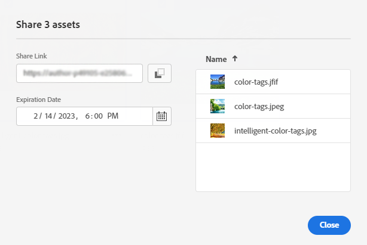

# Dela länkar till resurser {#share-links-assets}

Med [!DNL Assets Essentials] kan du skapa en länk och dela resurser med externa intressenter som inte har tillgång till programmet [!DNL Assets Essentials]. Du kan definiera ett förfallodatum för länken och sedan dela det med andra via den kommunikationsmetod du föredrar, som e-post eller meddelandetjänster. Mottagarna av länken kan förhandsgranska resurser och hämta dem.

## Generera en länk för resurser {#generate-link-for-assets}

Så här skapar du en länk för en resurs eller en mapp som innehåller resurser:

1. Markera resurserna och/eller mapparna som innehåller resurserna och klicka på **[!UICONTROL Share Link]**.

1. Om du vill justera den klickar du på kalenderikonen för att definiera ett förfallodatum för länken med hjälp av fältet **[!UICONTROL Expiration Date]**. Du kan också ange ett datum direkt i formatet `yyyy-mm-dd`. Som standard är förfallodatumet för en länk inställt på två veckor från delningsdatumet.

>[!NOTE]
> Datumformatet ändras baserat på det valda språkområdet.
> `de-DE` använder till exempel `dd-mm-yyyy`, `ja-JA` använder `yyyy-mm-dd`, medan `en-EN` använder `mm-dd-yyyy`.
>

1. Kopiera länken från fältet **[!UICONTROL Share Link]**.

   

1. Klicka på **[!UICONTROL Close]** och dela länken med hjälp av e-post eller andra samarbetsverktyg.

## Åtkomst till delade resurser {#access-shared-assets}

När mottagarna har delat den offentliga länken för resurserna kan de klicka på länken för att förhandsgranska eller hämta de delade resurserna i en webbläsare utan att behöva logga in på [!DNL Assets Essentials].

Klicka på länken, klicka på mappen för att navigera till resursen och klicka sedan på resursen för att förhandsgranska den. Du kan välja att visa de delade resurserna i en listvy eller en kortvy.

Du kan hålla muspekaren över den delade resursen eller den delade resursmappen för att antingen välja resursen eller hämta den.

Du kan också markera flera resurser och klicka på **[!UICONTROL Download]**. [!DNL Assets Essentials] hämtar de valda resurserna som en zip-fil. [!DNL Assets Essentials] skapar en undermapp i den överordnade ZIP-filen, med samma namn som resursen, för varje resurs som du väljer att hämta.

Om du vill hämta alla resurser samtidigt växlar du till **[!UICONTROL List view]**, klickar på **[!UICONTROL Select all]** och sedan på **[!UICONTROL Download]**.

## Nästa steg {#next-steps}

* [Titta på en video om du vill dela länkar för resurser i Assets Essentials](https://experienceleague.adobe.com/docs/experience-manager-learn/assets-essentials/basics/link-sharing.html).

* Ge produktfeedback med alternativet [!UICONTROL Feedback] som finns i användargränssnittet för Assets Essentials.

* Ge feedback genom att [!UICONTROL Edit this page]  eller [!UICONTROL Log an issue]  som är tillgängligt på den högra sidopanelen.

* Kontakta [kundtjänst](https://experienceleague.adobe.com/?support-solution=General#support).
